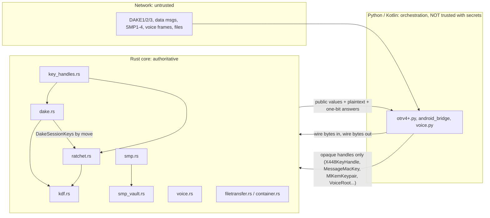

# OTRv4Plus cryptographic core audit, 2026-09

An internal technical review of the Rust cryptographic core (`Rust/src`). It
is **not** an external audit and does not replace one. The findings, tests and
harnesses are in the tree, so anyone can re-run and check them. The last
section gives the commands.

## 1. Executive summary

The core is in considerably better shape than its history suggests. The
earlier critical defects (ring-signature nonce reuse, ratchet commit-before-
authenticate, all-zero MAC revelation, profile signature unchecked in Rust,
ML-DSA stripping at DAKE3) are fixed and each has a regression test. Secrets
stay in Rust behind opaque handles in production builds.

The two most important findings are **design-level, not bugs**:

- **A1.** SPEC §5.2 promises that the ML-KEM brace key is folded into every
  ratchet root derivation. It is not. There is therefore no post-quantum
  post-compromise recovery.
- **A2.** The DAKE's post-quantum authentication covers the initiator only,
  and an active quantum adversary can strip it.

Post-quantum *confidentiality* of session keys does hold, because the DAKE's
ML-KEM secret is in every session key.

One real remote-reachable denial of service was found by fuzzing and fixed
(**A3**, a crafted `.otrv` header aborting the process). Three low-severity
hardening issues were fixed (**A4–A6**).

Differential tests against an independent ML-KEM/ML-DSA implementation agree
in every case. Statistical timing tests show no leak on the three paths
measured, and a leaky positive control shows the harness can detect one.

The shipped PQ primitives come from PQClean, which is being archived and does
not zeroize its key types. Migrating off it is the most valuable
implementation change available.

## 2. What was reviewed

| | |
|---|---|
| Branch HEAD reviewed | `324777a49aa08af23e86ca5af04020799497ec56` (branch `claude/otrv4plus-android-spec-a3oq4d`) |
| `main` at review time | `74a204adb38ce299456093080f875da8fda1600a` |
| Audit commits on top | `ccad947`, `4e5896f`, `305838d`, `cf074d0`, `1039aa5` |

**Which findings apply to `main`:** A1, A2, A4, A5 and A6 are present on
`main`; the same code is at the same place. A3 is in `container.rs`, which
exists only on the branch.

## 3. Architecture and trust boundary

| File | Responsibility |
|---|---|
| `dake.rs` | DAKE1/2/3 (3×X448 + ML-KEM-1024 → `mixed_secret`), profile verification, DAKE3 ring + ML-DSA verify, session-key derivation straight into the ratchet |
| `ratchet.rs` | Double ratchet: chain/root KDF, AES-256-GCM per message, skipped keys, replay cache, MKmac derivation and revelation, `MessageMacKey` handle |
| `kdf.rs` | `KDF_1` = SHAKE-256("OTRv4" ‖ usage ‖ value), chain/root/brace KDFs, HMAC-SHA3-512 |
| `ring_sig.rs` | 2-key Schnorr ring signature over Ed448 (DAKE3 deniable auth) |
| `smp.rs`, `smp_vault.rs` | Hybrid SMP: 3072-bit MODP ZKPs + ML-KEM binding key + ML-DSA-87 per step; Argon2id secret stretch (0x03) |
| `key_handles.rs`, `identity.rs`, `at_rest.rs` | Ed448/X448 handles, sealed identity records, at-rest DEK and SMP store |
| `mlkem.rs`, `mldsa.rs`, `aead.rs` | Primitive bindings (raw-key entry points compiled out of production) |
| `voice.rs` | Voice hybrid agreement, epoch roots, per-direction media keys, AES-GCM frames |
| `filetransfer.rs`, `container.rs` | Transfer key wrap from the DAKE extra symmetric key; `.otrv` at-rest/export container |
| `secure_mem.rs` | `SecretBytes`/`SecretVec` (ZeroizeOnDrop), `ct_eq`, `DakeSessionKeys` |



**Secrets crossing FFI in production builds: none found.**

- Raw-key entry points are behind `raw-key-test-api` or `test-only-kdf`.
  These include `RustDoubleRatchet::new/from_dakeresult`, `aes256gcm_*`,
  `mlkem1024_*`, `PyVoiceRoot.from_bytes`, `X448KeyHandle.from_priv_bytes`
  and `kdf_1`. `build.rs` refuses a release build with them enabled.
- Remaining Python-held key material:
  - The at-rest DEK bytes handed to `FileDek`/`seal_identity`. On Android it
    is unwrapped by the Keystore, by design.
  - The SMP passphrase, briefly, as a zeroed `bytearray`.
- Revealed MAC keys are public by design.

**Claimed threat model** (SECURITY.md, SPEC.md, SECURITY_INVARIANTS.md,
AUDIT_HANDOFF.md):

- Defended:
  - Network attacker, active or passive.
  - Harvest-now-decrypt-later quantum adversary, for confidentiality.
  - Forged or replayed messages.
  - Secret leakage into the Python heap.
  - Stale state after Wipe.
- Out of scope:
  - A compromised device or OS.
  - Physical flash forensics.
  - Traffic analysis beyond I2P.
- Deniability is claimed only as the MAC-revelation mechanism. The formal
  property is explicitly not claimed (SECURITY_ISSUES L1).

## 4. Primitive inventory (Rust/Cargo.lock)

| Primitive | Crate / version | Used for |
|---|---|---|
| Ed448 | ed448-goldilocks-plus 0.16.0 | profile signatures, ring signature |
| X448 | x448 0.6.0 | DAKE (×3), ratchet DH, voice |
| ML-KEM-1024 | pqcrypto-mlkem 0.1.1 (PQClean) | DAKE, brace rotation, SMP binding, voice |
| ML-DSA-87 | pqcrypto-mldsa 0.1.2 (PQClean) | DAKE3 (initiator), SMP steps |
| AES-256-GCM | aes-gcm 0.10.3 | ratchet messages, voice, files, at-rest |
| SHAKE-256 / SHA3 | sha3 0.10.9 | `KDF_1`, MKmac, fingerprints, outer MAC |
| HMAC-SHA3-512 | hmac 0.12.1 | SMP binding, DAKE MAC |
| HKDF-SHA256/512 | hkdf 0.12.4 | voice, container |
| Argon2id | argon2 0.5.3 | SMP 0x03, container passphrase |
| 3072-bit MODP | crypto-bigint 0.5.5 (CT exp), num-bigint 0.4.6 (VT scalar ops) | SMP |
| MLS | openmls 0.9.0 (own HPKE) | groups |

`cargo audit` reports 0 vulnerabilities in 333 crates. The unmaintained
PQClean crates are explicitly ignored with a recorded rationale
(`Rust/.cargo/audit.toml`).

## 5. Findings

Severity is impact as deployed. "Design" means the implementation does what
it was written to do, but that falls short of what the spec claims.

### A1 — High (spec divergence): brace key never folded into the ratchet

- **Where:** `Rust/src/ratchet.rs:232`, `:522` and `:572` call
  `kdf_root(&self.root_key, dh_secret)`. `kdf.rs:147` takes only
  `root ‖ dh_output`.
- **What:** SPEC §5.2 requires `root_key_input = dh_secret ‖ brace_key`.
  `rotate_brace_key` (`ratchet.rs:258`) updates `brace_key`, but no
  derivation ever reads it.
- **Impact:**
  - An ML-KEM brace rotation after the DAKE contributes nothing to any key.
  - After a state compromise, a quantum adversary can follow every later
    X448 ratchet step, so the session never heals against it.
  - Classical post-compromise security and PQ confidentiality from the DAKE
    root are unaffected.
- **Evidence:** `ratchet::audit_brace_folding::a_brace_rotation_does_not_change_the_next_chain`.
  Two ratchets with different brace keys derive identical root and chain
  keys after `send_ratchet`.
- **Fix:** derive `kdf_root(root, dh ‖ brace)`, gated on a protocol version
  both peers advertise. The fix changes every key after the first DH step,
  so it cannot ship unilaterally. Invert the pinned test when it lands.
  **Needs expert confirmation** of the intended design: SPEC also has each
  brace rotation carry its ek/ct in data messages, whose ordering relative to
  DH steps must be specified.

### A2 — Medium (design): PQ authentication is initiator-only and strippable

- **Where:** `dake.rs:404-416` (DAKE1 declares the ML-DSA key in an
  unauthenticated message) and `dake.rs:871-878` (DAKE3 flag).
- **What:** only the initiator ever signs with ML-DSA, and only if it
  committed a key in DAKE1. An active quantum adversary removes the DAKE1
  commitment and forges the Ed448 ring signature. The responder authenticates
  with X448/Ed448 only.
- **Impact:** no post-quantum *authentication* in either direction against
  an active quantum adversary. PQ confidentiality holds.
- **Fix:**
  - A policy that requires ML-DSA from contacts known to have it, so
    stripping becomes detectable.
  - A responder ML-DSA signature over the DAKE2 transcript.
  - Both need a new protocol version.
- SPEC §4.3 now states the scope.

### A3 — Medium (DoS), fixed: crafted `.otrv` header aborts the process

- **Where:** `container.rs` `Header::decode`. Fixed in `ccad947`; the check
  is now at `container.rs:160`.
- **What:** `8 * p.max(1)` ran on the unauthenticated lane count before `p`
  was bounded. The release profile sets `overflow-checks = true` and
  `panic = "abort"` (`Rust/Cargo.toml:207-219`), so `p = 0xffffffff` killed
  the app on `info`, open or import.
- **Evidence:** found on the first `fuzz/container_header` run
  (crash-c06dcdab…). Regression test
  `container::tests::a_huge_lane_count_is_refused_not_an_overflow`. The crash
  input replays clean after the fix, and 3.9M further runs were clean.
- **Wider lesson:** with overflow-checks and panic=abort in release, *every*
  arithmetic overflow on attacker-influenced input is a remote kill. Fuzzing
  is the right control, so keep the targets in CI.

### A4 — Low, fixed: identity point accepted as a ring member

- **Where:** `ring_sig.rs` (`decode_public_key`, `:135`, now used by sign and
  verify).
- **What:** the identity point decodes, since it is torsion-free, and has
  discrete log 0. Anyone could produce a valid ring signature over
  `(victim, identity)`.
- **Evidence:** `audit_identity_point::a_forgery_with_the_identity_key_satisfies_the_equation_but_is_refused`
  constructs the forgery and shows the equation holds, so the check does real
  work.
- **Reachability:** limited. A peer would need the identity point as its
  identity key. Its profile is also checked (A5), and pure Ed448 verify in
  the library already refuses the identity key; this is pinned in
  `dake::profile_tests`.

### A5 — Low, fixed: profile expiry and degenerate key enforced only in Python

- **Where:** `dake.rs:755` and `:762`.
- Rust now refuses an expired profile, with the same `expires <= now`
  boundary as `ClientProfile.decode`, and a degenerate identity key.
- The stale comment at `otrv4+.py:4934` is corrected.

### A6 — Low/Info, fixed: malleable ring-signature scalars

- **Where:** `ring_sig.rs:371`.
- **What:** scalars were reduced mod Q, so `s + Q` re-encodes any signature
  as a distinct valid one.
- **Now:** only canonical scalars are accepted. The recorded DAKE3 fixture
  still verifies. Test: `a_non_canonical_scalar_is_refused`.

### A7 — Low: PQClean key types are not zeroized

- **Where:** pqcrypto-mlkem 0.1.1 and pqcrypto-mldsa 0.1.2 (`simple_struct!`
  has no `Drop`). Every `SecretKey::from_bytes`, `decapsulate` and
  `SharedSecret` leaves an unwiped copy, for example at `dake.rs:799` and in
  `mlkem.rs`/`smp.rs`.
- **Impact:** residual secret copies in freed memory, outside the Zeroize
  discipline the rest of the core keeps.
- **Fix:** migrate to libcrux-ml-kem or RustCrypto `ml-kem`/`ml-dsa` with
  `zeroize`. This is already the plan in `audit.toml` because PQClean is
  unmaintained. `Rust/audit/tests/pq_differential.rs` is the equivalence
  check for that migration.

### A8 — Info: no FIPS 203 modulus check on peer encapsulation keys

- `pqcrypto_mlkem::PublicKey::from_bytes` accepts a non-canonical `ek`;
  RustCrypto refuses it. This is recorded by
  `pq_differential::a_non_canonical_encapsulation_key_is_refused_by_rustcrypto`.
- Security impact is negligible, since the key's owner picks the key anyway.
  But FIPS 203 §7.2 makes the check mandatory, and the migration in A7 gets
  it for free.

### A9 — Info: variable-time SMP scalar arithmetic (known)

- `smp.rs:775` computes `d = r − c·x mod q` with `num-bigint`. This is
  documented in SECURITY.md. Exponentiation is constant-time (crypto-bigint
  `DynResidue`).
- **Needs expert confirmation** whether the num-bigint multiply/reduce leaks
  enough about `x` to matter. SMP runs at most a few times per session.

### A10 — Info: late messages from a previous DH chain are lost

- **Where:** `otrv4+.py:4142` routes any header whose key differs from the
  current remote key to `decrypt_new_dh`. A late message from the *previous*
  chain fails authentication there; it is refused safely with no state change.
  `prev_chain_len` is carried in the header but never used to store the old
  chain's remaining keys.
- **Impact:** availability only; out-of-order messages across a ratchet step
  are dropped. There is no security impact.

### A11 — Info: bounded pre-authentication work in `decrypt_new_dh`

- Each forged new-DH header costs up to `MAX_SKIP` (1000) KDF steps and two
  X448 operations before the tag check (`ratchet.rs:511-533`). This is
  bounded and nothing is committed; fuzzing confirms no state damage. It is
  noted for rate-limiting at the transport.

### A12 — Info: test-only Python SMP KDF sits beside production modules

- `smp_engine_compat.py`, at the repo root and in `tests/`, re-implements the
  legacy 0x02 SMP stretch in Python. It holds the derived secret as `bytes`.
- It is imported only by `otrv4_testlib.py`, and the APK excludes it
  (`tests/test_apk_python_sources.py`). Its docstring's "matches Rust KDF
  exactly" is true only for 0x02; the default is 0x03 (Argon2id).
- **Recommendation:** keep only the `tests/` copy.

### A13 — Info: caller-supplied nonce in `FileDek.seal`

- `at_rest.rs:200` accepts the nonce from Python. The current callers use
  `os.urandom(12)`, which is fine.
- Generating the nonce inside Rust would remove the possibility of reuse by a
  future caller.

### Prior issues, re-checked

| ID | Status in this tree |
|---|---|
| C1 ring nonce reuse | Fixed. Hedged nonce `SHAKE(seed ‖ 32 random ‖ msg)`; `t1_is_not_reused_across_signatures` |
| RT-1 ratchet commit-before-auth | Fixed. Scratch derivation, commit after tag (`ratchet.rs:360-430`); `fuzz/ratchet_forgery` clean |
| L1 zero MAC revelation | Mechanism fixed and proven end to end (`test_mac_revelation_end_to_end.py`); formal deniability still unclaimed |
| H2 ML-DSA stripping at DAKE3 | Fixed, `a_stripped_ml_dsa_signature_is_refused`. The DAKE1-level strip is A2 |
| H3 profile signature in Rust | Fixed, `dake.rs:737` |
| R7 DAKE1 ML-DSA flag, R8 DH zeroize | Fixed |
| M1 SMP subgroup check, L3 `rb` validation | Fixed, `validate_group_elem` (`[2, p−2]` and `x^q = 1`) |
| C4 brace key getter | Removed |
| M3 legacy DAKE keys to Python | Resolved (compiled out) |
| G1 DAKE timeout stub | **Still open**: `otrv4+.py:4743` `is_expired` returns `False` |
| G2 two `otrv4_testlib.py` copies | **Still open** |

## 6. Confirmed correct / well implemented

- **Ratchet nonces:** AES-GCM with a single-use key per message and a random
  12-byte nonce, so a nonce collision cannot repeat a key.
- **Voice nonces:** `epoch ‖ counter` under a per-direction, per-epoch,
  per-sub-epoch key, so they are unique.
- **File-transfer nonces:** the chunk index, under a fresh key per transfer.
- **Container nonces:** `prefix ‖ index` under a fresh HKDF key per file,
  with the chunk count capped at `u32`.
- **Ratchet commit discipline:** forged input never mutates state (tests plus
  431k fuzz runs).
- **Skipped keys:** peeked, authenticated, then consumed.
- **Replay:** blocked by the cache and by the message number.
- **MKmac:** `KDF(0x14, MKenc, 64)`, revealed after use in both directions,
  and cross-checked by fingerprints that are hashes, not keys.
- **DAKE confidentiality:** `mixed_secret = KDF(dh1 ‖ dh2 ‖ dh3 ‖ mlkem_ss)`,
  so an attacker must break X448 and ML-KEM. All-zero X448 outputs are
  refused.
- **DAKE3:** the ring signature over `KDF(AUTH_I_MSG, DAKE1 ‖ DAKE2)` binds
  roles and keys (`the_roles_and_keys_are_bound`).
- **SMP group checks:** range and prime-order-subgroup validation for every
  group element.
- **SMP ZKPs:** challenges are domain-separated per proof index.
- **SMP final comparison:** constant time.
- **SMP transport:** a version byte with no silent downgrade, and ML-DSA over
  a running transcript MAC.
- **SMP stretching:** Argon2id with a per-session, per-pair salt.
- **Secret handling:** SecretBytes/SecretVec with ZeroizeOnDrop throughout,
  explicit `zeroize()` on every handle, and wipes that do not depend on
  garbage collection.
- **Build guard:** `build.rs` refuses release builds that include raw-key
  APIs.
- **Constant-time comparisons:** `secure_mem::ct_eq` (subtle) is used for
  every MAC, tag and SMP comparison in Rust. Python's voice checks use
  `hmac.compare_digest`.
- **PQ primitives:** they agree with an independent implementation in every
  tested direction, including implicit rejection.

## 7. Gaps that need a human cryptographer or formal methods

1. **Formal deniability** of the DAKE with a 2-member ring (OTRv4 specifies
   3) and the added ML-DSA signature. The ML-DSA signature is attributable,
   and SPEC §10.1 says so. Whether the composition is still offline-deniable
   when it is absent needs a proof.
2. **Hybrid DAKE security** as a whole: key-compromise impersonation, UKS,
   and the effect of A2. This is a good fit for Tamarin or ProVerif.
3. **The A1 redesign:** exactly where the brace KEM rides and how it
   interleaves with DH steps and message loss.
4. **SMP ZKP soundness** with the PQ binding layer, and whether the
   variable-time scalar arithmetic (A9) is exploitable.
5. **Constant time beyond the three measured paths:** SMP and X448 inside
   the crates. That needs a dudect or ctgrind run on target hardware
   (ARM64), not a shared x86 VM.

## 8. Next actions, ranked by risk reduction per unit of effort

| # | Action | Effort | Reduces |
|---|---|---|---|
| 1 | Run all 8 fuzz targets in CI (nightly, 10 min each), especially `smp_messages` with a structured input generator | S | Remote aborts like A3 |
| 2 | Migrate ML-KEM/ML-DSA to libcrux or RustCrypto; `pq_differential.rs` is the equivalence gate | M | A7, A8, and the unmaintained-crate risk |
| 3 | Fix G1 (DAKE handshake timeout stub) | S | Stuck-handshake state |
| 4 | Versioned protocol v2: brace folding (A1) and responder ML-DSA plus a stripping policy (A2) | L | PQ post-compromise security, PQ authentication |
| 5 | **Paid scoped review**: DAKE + ratchet + SMP (§5 A1/A2, §7 items 1-4). The code is small (~6k lines of Rust in scope), well tested and documented, which makes it a good candidate for a fixed-scope review or an OTF / NLnet grant | – | Everything this audit could not settle |
| 6 | Move FileDek nonce generation into Rust (A13); delete the root copy of `smp_engine_compat.py` (A12) | XS | Future misuse |

## 9. Tests, harnesses and checks added

**Rust unit tests** (`cargo test --release --lib`, 150 total, up from 139):

- `ring_sig::audit_identity_point`: 5 tests covering the forgery PoC, the
  torsion/identity check, the signer refusal, honest rings, and canonical
  scalars.
- `dake::profile_tests`: 4 tests covering a current profile, an expired one,
  the expiry boundary, and the identity-key profile.
- `ratchet::audit_brace_folding`: pins A1.
- `container::tests::a_huge_lane_count_is_refused_not_an_overflow`:
  regression for A3.

**Fuzz targets:** 8, in `Rust/fuzz`; see `Rust/fuzz/FUZZING.md`.

**Differential tests** (`Rust/audit/tests/pq_differential.rs`): 8 tests,
PQClean against RustCrypto for ML-KEM-1024 and ML-DSA-87.

**Timing tests** (`Rust/audit/tests/timing_dudect.rs`): 4 tests, including a
positive control.

**Python:** `test_kdf_claims_are_true::test_the_container_uses_it_only_for_passphrases`.

**Fuzz campaign results** (this environment, 4 cores, about 150 s per target
unless noted):

| Target | Runs | Result |
|---|---|---|
| ratchet_header | 86.6M | clean |
| ratchet_forgery | 431k | clean |
| dake1_parse | 105k | clean |
| dake2_parse | 105k | clean |
| dake3_verify | 18.9k | clean |
| ring_verify | 1.7k | clean (slow: signs per run) |
| smp_messages | 374 (≈15 min) | clean; **shallow**, about 2 s per input |
| container_header | 1 crash (A3), then 3.9M | clean after fix |

**Timing results** (200k samples; ring_sign 4k samples; max |t| over crop
percentiles; threshold 10):

| Path | max \|t\| |
|---|---|
| Control: early-exit compare | 4523 / 7272 (detected) |
| `secure_mem::ct_eq` | 1.2 / 2.2 |
| `kdf::verify_mac`, reject-early vs reject-late | 1.6 |
| `ring_sign_bytes`, fixed vs random secret | 1.0 / 1.5 |

A clean result is evidence, not proof: it was measured on a shared x86 VM,
not on the ARM64 handsets that ship.

**Full suites after the audit:**

| Suite | Result |
|---|---|
| Python | 6214 passed, 51 skipped, 1 xfailed |
| Rust core | 150 passed |
| Rust MLS | 33 passed |
| PQ differential | 8 passed |
| Timing | 4 passed |
| clippy | clean |

## 10. Reproduction

```sh
git checkout 1039aa5            # or later on claude/otrv4plus-android-spec-a3oq4d
cd Rust

# Unit tests, including every audit test
cargo test --release --lib
cargo test --release --lib audit_          # A1 pin, A4/A6 PoCs
cargo test --release --lib profile_tests   # A5
cargo test --release --lib a_huge_lane     # A3 regression
(cd mls && cargo test --release)

# Static
cargo clippy --release --lib --features mls
cargo clippy --release --lib --features mls -- -W clippy::indexing_slicing -W clippy::expect_used -W clippy::panic
cargo audit                                 # core: 0 vulnerabilities
(cd mls && cargo audit)

# Fuzzing
rustup toolchain install nightly && cargo install cargo-fuzz
cargo +nightly fuzz build
for t in ratchet_header ratchet_forgery dake1_parse dake2_parse dake3_verify ring_verify smp_messages container_header; do
  cargo +nightly fuzz run $t -- -max_total_time=300
done

# Differential and timing
cd audit
cargo test --release --test pq_differential
cargo test --release --test timing_dudect -- --ignored --nocapture --test-threads=1
cd ..

# Python suite against the rebuilt core
OTRV4PLUS_ALLOW_RAW_KEY_TEST_API=1 cargo build --release --features extension-module,raw-key-test-api,mls
cp target/release/libotrv4_core.so ../otrv4_core.so
cd .. && OTRV4PLUS_ALLOW_RAW_KEY_TEST_API=1 python3 -m pytest tests/ -q
```
