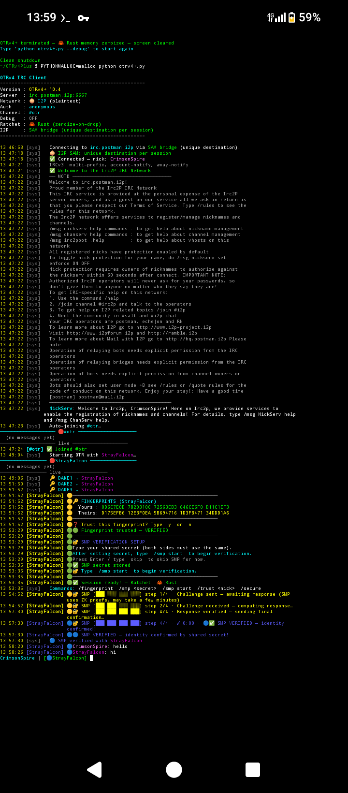

<p align="center">
  
</p>

<h1 align="center">OTRv4+</h1>
<p align="center"><strong>Post‑quantum encrypted IRC. Runs on your phone over I2P, Tor, or clearnet. Leaves no trace.</strong></p>

<p align="center">
  <a href="#installation">Install</a> ·
  <a href="#quick-start">Quick start</a> ·
  <a href="#commands">Commands</a> ·
  <a href="#security-features">Security</a> ·
  <a href="#license">License</a>
</p>

---

## One‑line install (Android / Termux)

```bash
git clone https://github.com/muc111/OTRv4Plus.git && cd OTRv4Plus && chmod +x termux_install.sh && ./termux_install.sh && PYTHONMALLOC=malloc python otrv4+.py
```

The installer builds all C extensions and the Rust ratchet core, or falls back to prebuilt binaries automatically – no manual compilation needed. For Linux and macOS see Installation.

---

What is this?

OTRv4+ is a complete implementation of the OTRv4 specification with post‑quantum cryptography at every layer.
Key exchange: ML‑KEM‑1024 (Kyber1024) hybridised with X448.
Authentication: ML‑DSA‑87 (ML-DSA-87, FIPS 204) added to the Ed448 ring signatures.
Ratchet: Fresh ML‑KEM encapsulation at every DH ratchet step, keeping forward secrecy quantum‑resistant throughout the session.

It runs as a single terminal IRC client over I2P, Tor, or clearnet, and wipes all key material on exit.

The OTRv4 spec has existed for years with zero complete, maintained implementations. This fills that gap and adds PQC on top.

---

v10.5.8 – Stable post‑quantum backend

This release migrates from the old ml‑kem/ml‑dsa pre‑release RC crates (which had unstable APIs and dependency conflicts) to the stable, audited pqcrypto‑kyber (v0.8) and pqcrypto‑mldsa (v0.1.2) crates.

· No more RC dependencies – production‑ready PQ libraries.
· No crypto‑common version conflicts – clean compilation.
· All tests pass – 313 tests, identical security guarantees.

The Rust core now compiles with zero warnings, zero errors, and the cryptographic primitives are identical to the previous RC versions (same ML‑KEM‑1024 and ML‑DSA‑87 parameters).

---

Live demo – Termux on Android

DAKE handshake, fingerprint exchange, and 4‑step SMP identity verification over I2P SAM bridge:

<p align="center">
  
</p>

The screenshot shows a complete session: SAM bridge connection → DAKE3 completing with Ed448 ring signatures → SHA3‑512 fingerprint trust → SMP zero‑knowledge proof running all four steps → Rust double ratchet session live. Nick is randomised on every launch.

---

Quick start

1. Launch: PYTHONMALLOC=malloc python otrv4+.py
2. Join a channel: /join #otr
3. Start an encrypted session with another user: /otr bob
4. Verify their identity: /smp secret (both users type the same passphrase – nothing is sent over the wire)

That's it. The client defaults to irc.postman.i2p with auto‑network detection: .i2p → I2P, .onion → Tor, everything else → TLS.
To connect to a different server: python otrv4+.py -s irc.libera.chat:6697

---

Security features

 
🔐 Post‑quantum handshake ML‑KEM‑1024 + X448 hybrid → quantum‑safe session keys from the first message
🔄 Post‑quantum ratchet Fresh ML‑KEM encapsulation every DH ratchet epoch – compromise of one epoch doesn't open others
🪪 Deniable authentication Ed448 + ML‑DSA‑87 ring signatures – you know who you're talking to; no third party can prove it
🧐 Zero‑knowledge identity verify SMP protocol – prove you both know a shared secret without sending it
🧅 Network agnostic Auto‑detects I2P / Tor / clearnet – same client, same commands, no config changes
👤 No persistent identity Random nick every launch; fresh I2P destination every session with SAM
🧹 Zero traces on exit Rust Zeroize, OPENSSL_cleanse, NIST SP 800‑88r1 file destruction – nothing recoverable after /quit
🔒 E2E encrypted OTRv4 – the IRC server admin sees ciphertext and metadata only
📱 Runs on a phone Termux on Android, one‑command install, no root required

Honest tradeoffs: both parties must be online simultaneously (this is IRC, not Signal). No async messaging, no push notifications. If you need async use Signal. If you need synchronous, deniable, post‑quantum chat that leaves no trace, this is it.

---

Installation

Android – Termux

```bash
git clone https://github.com/muc111/OTRv4Plus.git && cd OTRv4Plus && chmod +x termux_install.sh && ./termux_install.sh && PYTHONMALLOC=malloc python otrv4+.py
```

<details>
<summary>What the installer does</summary>

Stage What happens
[1/5] System deps pkg install python rust openssl clang make binutils
[2/5] Python tools pip install maturin setuptools
[3/5] Clean Removes stale build artefacts
[4/5] API level Reads your device's Android API level via getprop (defaults to 24)
[5/5] C extensions Builds otr4_crypto_ext, otr4_ed448_ct, otr4_mldsa_ext with setup_otr4.py
[6/6] Rust core cargo build --release --features pq-rust → copies libotrv4_core.so into the project root

Automatic prebuilt fallback: if any build step fails (missing compiler, old toolchain), the script copies the prebuilt .so files from prebuilt/ and continues. You get a working install either way.

</details>

I2P: The default server is irc.postman.i2p. You need i2pd running:

```bash
pkg install i2pd && i2pd --daemon
```

Wait ~3 minutes for I2P to bootstrap, then launch OTRv4+.

Prebuilt binaries

If you're on Termux (aarch64) and don't want to build from source, prebuilt/ contains ready‑to‑use .so files. Copy them to the project root and skip all build steps.

Linux / macOS

<details>
<summary>Manual build instructions</summary>

Requirements: Python 3.9+, OpenSSL 3.5+, C compiler, Rust toolchain.

Debian / Ubuntu (23.04+)

```bash
sudo apt install python3 python3-dev python3-venv libssl-dev build-essential git
python3 -m venv ~/otr-env && source ~/otr-env/bin/activate
pip install cryptography pysocks argon2-cffi maturin
curl --proto '=https' --tlsv1.2 -sSf https://sh.rustup.rs | sh && source ~/.cargo/env

git clone https://github.com/muc111/OTRv4Plus.git && cd OTRv4Plus
python setup_otr4.py build_ext --inplace
bash build_ed448.sh
gcc -shared -fPIC -O2 -o otr4_mldsa_ext.so otr4_mldsa_ext.c \
    $(python3-config --includes) $(python3-config --ldflags --embed) -lcrypto

cd Rust && cargo test --release && maturin build --release
pip install target/wheels/otrv4_core-*.whl && cd ..

PYTHONMALLOC=malloc python otrv4+.py -s irc.libera.chat:6697
```

Always source ~/otr-env/bin/activate before launching.

Arch Linux

```bash
sudo pacman -S python python-pip openssl base-devel git rust
python3 -m venv ~/otr-env && source ~/otr-env/bin/activate
pip install cryptography pysocks argon2-cffi maturin
```

Then follow the same build steps as Debian above.

macOS

```bash
brew install python openssl@3 git rust
python3 -m venv ~/otr-env && source ~/otr-env/bin/activate
LDFLAGS="-L$(brew --prefix openssl@3)/lib" CFLAGS="-I$(brew --prefix openssl@3)/include" \
    pip install cryptography pysocks argon2-cffi maturin
```

Then clone and follow the same build steps.

</details>

---

Commands

IRC
/join [#channel] /part /nick [name] /msg [nick] [text] /names /topic /list /whois [nick] /invite /kick /mode /notice /away /back /raw /reconnect /quit

OTR / encryption
/otr [nick] start encrypted session
/endotr [nick] end session
/fingerprint show your fingerprint
/trust [nick] manually trust a fingerprint
/smp secret verify identity by shared secret
/smp start /smp abort /smp status
/secure show session security status

UI / tabs
/switch [name] /tabs /tab-next /tab-prev /tab-close /clear /ignore /unignore /ignored /status /debug /version

/join, /switch, /part, /names all accept the channel name with or without #.

---

Technical details

<details>
<summary>🔐 Cryptographic design</summary>

DAKE (Deniable Authenticated Key Exchange)

· DAKE1: X448 ephemeral + ML‑KEM‑1024 encapsulation key + client profile + optional ML‑DSA‑87 public key
· DAKE2: X448 ephemeral + ML‑KEM‑1024 ciphertext + client profile + optional ML‑DSA‑87 public key + MAC
· DAKE3: Ed448 ring signature + optional ML‑DSA‑87 signature

Both peers contribute to the session key via X448 + ML‑KEM. ML‑DSA fields use a flag byte (0x01 present / 0x00 absent) – peers without ML‑DSA fall back to classical ring signatures only.

Double ratchet

Pure Rust implementation (otrv4_core). Root key, chain keys, and message keys derived via SHAKE‑256 KDF with "OTRv4" domain separator per spec §3.2. Fresh ML‑KEM encapsulation at every DH ratchet epoch. Brace key rotated every REKEY_INTERVAL messages. Zeroize on drop; all unsafe blocks forbidden.

Wire format

```
DAKE1: 0x35 ‖ X448_eph(56) ‖ MLKEM_ek(1568) ‖ profile(var) [‖ MLDSA_pub(2592)]
DAKE2: 0x36 ‖ X448_eph(56) ‖ MLKEM_ct(1568) ‖ profile(var) [‖ MLDSA_pub(2592)] ‖ MAC(64)
DAKE3: 0x37 ‖ ring_sigma(228) ‖ flag(1) [‖ MLDSA_sig(4627)]
DATA:  0x00 ‖ 0x04 ‖ 0x03 ‖ header(64) ‖ nonce(12) ‖ ct(var) ‖ tag(16)
```

Messages fragment at 300 bytes for IRC line limits using OTR §4.7 wire format.

SMP (Socialist Millionaire Protocol)

3072‑bit safe prime. Secret bound to session ID + both fingerprints to prevent cross‑session brute force. Minimum 8‑character passphrase enforced. Zero‑knowledge – the passphrase never travels the wire.

KDF

All key derivation uses SHAKE‑256("OTRv4" ‖ usage_ID ‖ value, size) per spec §3.2. Usage IDs 0x00–0x1F are domain‑separated to prevent key conflation.

Post‑quantum backend (v10.5.8)

The Rust core now uses the stable pqcrypto‑kyber (v0.8) and pqcrypto‑mldsa (v0.1.2) crates, replacing the previous ml‑kem/ml‑dsa pre‑release versions. This eliminates dependency conflicts and guarantees a consistent, production‑ready API. The cryptographic parameters are identical – ML‑KEM‑1024 and ML‑DSA‑87 – so there is no change in security.

</details>

<details>
<summary>🧠 Memory security</summary>

· Rust ratchet core: Zeroize trait on all key structs; no unsafe blocks
· C extensions: OPENSSL_cleanse on all key buffers before deallocation
· Python secrets: bytearray + _ossl.cleanse() for session keys, SASL credentials, and SMP secrets – never plain bytes
· Key storage: AES‑256‑GCM, Argon2id (64 MB, 3 passes, parallelism 2) for the master key
· File destruction: NIST SP 800‑88r1 – AES‑256‑GCM re‑encrypt with ephemeral key, overwrite with zeros and random, then unlink
· SMP secrets: RustSMPVault – secrets enter Rust memory immediately, zeroized after use
· On /quit: all ratchets zeroized, all C buffers cleansed, ~/.otrv4plus/ deleted, terminal cleared

</details>

<details>
<summary>⚖️ Comparison with Signal</summary>

Signal's PQXDH adds ML‑KEM to the initial handshake but their own spec notes that "authentication in PQXDH is not quantum‑secure." More importantly, after the handshake the ratchet is purely classical – compromise one epoch key and you can decrypt forward.

OTRv4+ adds ML‑KEM encapsulation at every DH ratchet epoch, so forward secrecy is post‑quantum throughout the session, not just at setup. ML‑DSA‑87 provides post‑quantum authentication. The tradeoffs are no async support (both parties online simultaneously), no push notifications, and no PQ deniability – that's an open research problem nobody has solved yet; the flag‑byte mechanism supports upgrading when it exists.

</details>

<details>
<summary>📋 Known issues</summary>

· SMP exponents briefly exist as Python ints during each step (microseconds) before entering the Rust vault
· DAKE DH shared secrets pass through Python briefly before the KDF (microseconds – private keys stay in OpenSSL's C heap)
· Fragment count leaks message type to a local observer (DAKE = 20–25 fragments in a burst)
· The random nick pool (~11,000 names) reduces but doesn't eliminate cross‑session correlation
· Clearnet exposes your IP in WHOIS until cloaking kicks in – use I2P or Tor
· PQ deniability doesn't exist as a primitive anywhere; it's an open research problem

None of these are cryptographic breaks. The first two are microsecond memory hygiene gaps. The rest are network/metadata issues that apply to all IRC clients.

</details>

---

Tests

313 tests (299 Python + 14 Rust) covering: double ratchet across 100k messages, replay and forgery resistance, ML‑KEM‑1024 known‑answer vectors, ML‑DSA‑87 smoke tests, ring signature non‑malleability, SMP full protocol flow, property‑based protocol verification, and v10.4 security regression.

```bash
# Rust tests
cd Rust && cargo test --release && cd ..

# Python tests
pip install pytest hypothesis
PYTHONPATH=. pytest tests/ -v
```

<details>
<summary>Full test file list</summary>

File What it covers
test_differential.py TLV encoding, KDF vectors, ratchet differential, wire format regression
test_property.py AES‑GCM, KDF, MAC, TLV, ML‑KEM, ring sigs, double ratchet, network detection
test_harness_audit.py Full DAKE + SMP protocol flow
test_master_protocol_verifier.py End‑to‑end protocol state machine
test_final_boss.py Composite integration (depends on master verifier)
test_otrv4_integration.py DAKE handshake, ratchet, fragmentation
test_ratchet_torture.py 100k‑message ratchet, replay, out‑of‑order delivery
test_rust_security.py Rust vault zeroization, AES‑GCM key storage
test_rust_security_adversarial.py Adversarial Rust ratchet scenarios
test_mlkem_kat.py ML‑KEM‑1024 known‑answer test vectors
test_mldsa_smoke.py ML‑DSA‑87 sign/verify smoke test
test_ring_android.py Ring signature correctness on Android/aarch64
test_otr.py C extension import and smoke test
test_v10_4_security_fixes.py v10.4 regression suite (7 security fixes)
test_attacks.py Replay, forgery, and protocol attack resistance
fuzz_harnesses.py Wire format and fragment fuzzing

</details>

<details>
<summary>Test setup (symlinks required)</summary>

otrv4+.py can't be imported directly – + is illegal in Python module names. Three symlinks are needed:

```bash
ln -sf otrv4+.py otrv4_.py
ln -sf otrv4+.py otrv4plus.py
ln -sf ../otrv4+.py tests/otrv4+.py
```

All three are committed to the repo so a fresh clone works without this step.

</details>

---

Why use this

<details>
<summary>Threat model and use cases</summary>

The server sees nothing. All messages are end‑to‑end encrypted with OTRv4. The IRC server admin gets ciphertext and metadata – who's talking to who, when, and roughly how much. They cannot read a single word.

Quantum computers won't break your old logs. ML‑KEM‑1024 at the handshake plus fresh KEM material rotated with every DH ratchet means someone who records everything today and throws a quantum computer at it in 2030 can't recover session keys.

No persistent identity. Random nick on every launch. Fresh I2P destination every session when SAM is enabled. No account, no email, no phone number. You show up, talk, and disappear – next session you're a different person as far as the network is concerned.

Deniable authentication. Ed448 ring signatures mean neither party can prove to a third party that the other person said anything specific. You know who you're talking to. Nobody else can prove it.

SMP verification without revealing secrets. The shared passphrase is never sent over the wire. The protocol proves you both know it via zero‑knowledge exchange. Nothing to brute‑force after the fact.

Everything wipes on exit. /quit zeroizes every Rust ratchet, cleanses every C extension buffer, clears the terminal, and deletes ~/.otrv4plus/. Nothing in swap, nothing in temp files.

Intended for journalists, researchers, activists, and anyone who needs synchronous, deniable, post‑quantum chat that leaves no trace. If you need async messaging Signal is better. This is for sessions where both parties are present and traces are unacceptable.

</details>

---

WeeChat plugin

Same crypto, different frontend. Drop the plugin files into ~/.local/share/weechat/python/ and run /python load weechat_otrv4plus.py inside WeeChat.

---

Development

Built with AI‑assisted development (Claude). All cryptographic implementations verified through 313 automated tests, live DAKE and SMP exchanges between Termux instances over I2P, and a full security audit with all findings patched. The Rust ratchet core contains zero unsafe blocks.

---

License

GPL‑3.0 – see LICENSE. Commercial licensing available – see COMMERCIAL‑LICENSE.md.

---

"Arguing that you don't care about the right to privacy because you have nothing to hide is no different than saying you don't care about free speech because you have nothing to say." Edward Snowden
