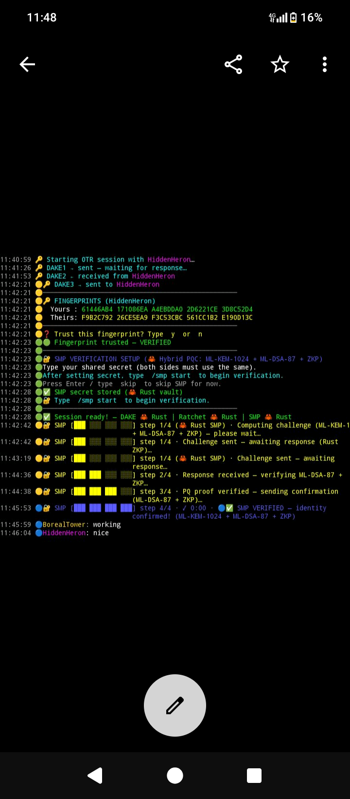

<p align="center">
  
</p>

<h1 align="center">OTRv4+</h1>
<p align="center"><strong>Post-quantum hybrid encryption for OTR over IRC. Experimental, unaudited research prototype.</strong></p>

<p align="center">
<code>v10.9.2 · Rust crypto core · hybrid PQC SMP (ML-KEM-1024 + ML-DSA-87) · I2P SAM · TUI</code>
</p>

---

## In action

<p align="center">
  
</p>

<p align="center"><em>Full OTRv4 DAKE + SMP verification with a hybrid PQC layer (ML-KEM-1024 + ML-DSA-87 + classical ZKP). Blue 🔵 = identity confirmed. Tested live on both Libera.chat TLS and irc.postman.i2p I2P SAM.<br>Ctrl+P or Ctrl+S to pause and scroll back. Type <code>/tui</code> to toggle pinned chrome.</em></p>

---

## What this is

OTRv4+ is an IRC client that implements OTRv4 with a post-quantum hybrid layer added at each stage of the protocol — including the SMP identity-verification step. It runs on Termux (Android) over I2P, Tor, or TLS clearnet, with a Rust crypto core wrapped by a thin Python orchestration layer.

**Single-author research prototype. Not a finished product, and not audited.** The author is not a cryptographer. The protocol composition (the DAKE wiring, the hybrid SMP construction) has had no external review, and the Rust crypto crates it depends on (`ed448-goldilocks-plus`, `x448`, `pqcrypto-mlkem`, `pqcrypto-mldsa`) have had no formal review either. Use it to study or extend, not because you need a hardened tool today. If your safety depends on the security of your messaging, use something audited.

## Where it fits

OTRv4+ occupies a narrow niche. Here is roughly where it sits relative to other tools — accurate to the best of the author's knowledge; corrections welcome:

| | OTRv4+ | Signal | Stock OTRv4 | Matrix/Element |
|---|---|---|---|---|
| Identifier required | None (IRC nick) | Phone number | None | Email/phone |
| Transport | IRC over I2P / Tor / TLS | Centralised servers | IRC/XMPP | Centralised homeservers |
| Post-quantum KEM | ML-KEM-1024, every DH ratchet step | ML-KEM-1024, initial handshake (PQXDH) | None | None |
| Post-quantum signatures | ML-DSA-87 | No | No | No |
| Post-quantum SMP | Yes (hybrid) | N/A (no SMP) | No | No |
| Deniable auth | Ed448 ring signatures | Yes (X3DH/PQXDH) | Yes | No |
| Network-layer anonymity | I2P (new destination per session) | No | Depends | No |

**The niche:** synchronous, pseudonymous, end-to-end encrypted conversation where both parties are online, no phone number or account exists, the network layer hides your IP, and Category-5 post-quantum parameters (ML-KEM-1024, ML-DSA-87) are used throughout — including the SMP identity check, which is an unusual place to add post-quantum hardening. Whether that hardening actually holds depends on the construction being correct, which has not been reviewed.

A note on the KEM row, since it is easy to get wrong: Signal's PQXDH also uses ML-KEM-1024 (Category 5), so the two are at the same parameter level. The difference is *placement* — PQXDH applies the KEM to the initial key agreement, whereas OTRv4+ re-runs a fresh ML-KEM-1024 exchange at every DH ratchet step. That is the honest distinction; it is not a claim that OTRv4+ is "more post-quantum" than Signal.

Signal is faster, asynchronous, and the right choice for almost everyone. OTRv4+ is for the sessions where you want a pseudonymous, account-free channel over an anonymising network with a shared-secret identity check, and are willing to pay the latency cost: a full hybrid-PQC handshake over I2P takes about 15 minutes. See [WHY.md](WHY.md) for the longer rationale.

## Quick start

For someone who wants to try it in about ten minutes on Termux (Android, aarch64).

### 1. Install dependencies

```bash
pkg install python rust openssl clang git
```

For **clearnet/TLS** (fastest, no extra setup):
```bash
python otrv4+.py -s irc.libera.chat
```

For **I2P** (strongest anonymity): you need I2P running with the SAM bridge enabled on port 7656. The I2P Android app from F-Droid or Google Play handles this; enable "Use SAM bridge" in its settings.

For **Tor**: Orbot must be running with SOCKS5 on port 9050.

### 2. Clone and build

```bash
git clone https://github.com/muc111/OTRv4Plus.git
cd OTRv4Plus

# Build the Rust crypto core (about 3 minutes on a modern phone)
cd Rust
cargo build --release --no-default-features --features pq-rust
cp target/release/libotrv4_core.so ../otrv4_core.so
cd ..
```

As of v10.7.5 the project is **Rust-core-only**: there are no C extensions to compile and no Python `cryptography` dependency. The Rust core is the single cryptographic surface.

### 3. Verify the build (recommended)

```bash
cd Rust
cargo test --release --no-default-features --features pq-rust
cd ..
```

Expected: `test result: ok. 30 passed; 0 failed` (17 existing + 15 hybrid PQC SMP tests). The two that matter most are `test_vectors::tests::ed448_rfc8032_vectors_byte_exact` (Rust Ed448 against RFC 8032) and `key_handles::tests::x448_rfc7748_known_answer` (Rust X448 against RFC 7748 §5.2).

What these tests do and do not tell you: a pass confirms the **primitives** (Ed448, X448) match their published RFC vectors byte-for-byte, so the low-level math is implemented correctly. It does **not** certify the surrounding protocol — the DAKE wiring and the hybrid SMP construction are unreviewed, and no test here can establish that they are secure. Treat a green run as "the building blocks are correct," not "the system is safe."

### 4. Run it

```bash
PYTHONMALLOC=malloc python otrv4+.py --debug
```

You should see the banner, the I2P SAM bridge handshake, the IRC connection to `irc.postman.i2p`, an auto-join of `#otr`, and a prompt. Other users in `#otr` running the same client are available for an OTR session.

### 5. Talk to a peer

If another user is in `#otr` (their nick is `SomeNick`), type:

```
/otr SomeNick
```

This starts the OTRv4 DAKE handshake. Fingerprints display once the DAKE completes. Type `y` to trust. Either side then types a shared SMP secret (agreed out of band) and runs `/smp start`.

Typical completion times (measured, hybrid PQC SMP v10.9.1):
- **TLS clearnet** (Libera.chat): DAKE + SMP verified in **under 6 minutes**
- **I2P SAM** (irc.postman.i2p): DAKE + SMP verified in **~15–16 minutes** (fragment rate limiting required due to server flood policy)
- **Tor**: 8–12 minutes (estimated)

You see `✅ SMP VERIFIED` in blue when done.

From that point, messages typed in the peer tab are end-to-end encrypted with the hybrid post-quantum scheme.

## TUI mode

OTRv4+ includes a built-in terminal UI that pins a tab bar and input line at the bottom of the screen, keeping your chat history visible above it — useful on mobile where screen space is limited.

```
22:11:29 🔵CobaltBear: works
22:11:30 🔵WildTallow: nice
22:13:57 🔵WildTallow: ok
─────────────────────────────────────────────────────────
WildTallow | [🔵CobaltBear]
[system🔴(1)] | [debug🔴(6929)] | [#otr🔴(1)] | [CobaltBear🔵]
```

**Toggle it on or off:**

```
/tui
```

Or explicitly:

```
/tui on
/tui off
```

TUI is off by default — the client works as a standard scrollback IRC client without it. Enable it when you want the pinned chrome, especially on Termux where the terminal doesn't scroll cleanly.

**Tab switching** (works with or without TUI):

```
/switch CobaltBear     # jump to a peer tab by name
/tab-next              # cycle right
/tab-prev              # cycle left
```

Tabs show security level icons — 🔴 plaintext, 🟡 encrypted, 🟢 trusted fingerprint, 🔵 SMP verified. Unread message counts appear in brackets: `[#otr🔴(3)]`.

## What success looks like

During a clean DAKE in `--debug` mode, you should see lines like:

```
[ClientProfile] Fresh Rust-owned identity keys — expires <date>
[OTR:peer] SESSION: None → PLAINTEXT | session created
[OTR:peer] ROLE: None → INITIATOR
...
[OTR:DAKE] STATE: IDLE → RECEIVED_DAKE1 | received DAKE1 (Identity)
[OTR:DAKE] STATE: RECEIVED_DAKE1 → SENT_DAKE2 | generated DAKE2 (Auth-R)
[OTR:DAKE] STATE: SENT_DAKE2 → ESTABLISHED | DAKE3 verified — hybrid (ring-sig ✓ + ML-DSA-87 ✓)
[OTR:peer] RATCHET: None → ACTIVE | ratchet: Rust (Phase-4 opaque handle; keys never in Python)
[OTR:peer] SMP: VERIFIED → STATE_UPDATED | role=responder
🔵✅ SMP VERIFIED — identity confirmed! (ML-KEM-1024 + ML-DSA-87 + ZKP)
```

After that, the peer tab is green (encrypted + verified) and your typed messages are end-to-end encrypted.

## Architecture

```
┌─────────────────────────────────────────────┐
│  IRC transport (I2P / Tor / TLS 1.3)        │
├─────────────────────────────────────────────┤
│  Python orchestration layer                 │
│  (thin wrapper, no secrets on Python heap,  │
│   no Python cryptography library)           │
├─────────────────────────────────────────────┤
│  Rust core (otrv4_core)                     │
│  Ed448KeyHandle / X448KeyHandle             │
│  verify_ed448_sig                           │
│  Double Ratchet (X448 DH in Rust)           │
│  DAKE state machine                         │
│  SMP state machine                          │
│  DakeOutput opaque handle                   │
│  SecretBytes / SecretVec                    │
│  ZeroizeOnDrop everywhere                   │
├─────────────────────────────────────────────┤
│  Pure-Rust crypto crates                    │
│  ed448-goldilocks-plus, x448, sha3,         │
│  aes-gcm, pqcrypto-mlkem (FIPS 203          │
│  ML-KEM-1024), pqcrypto-mldsa (FIPS 204     │
│  ML-DSA-87)                                 │
└─────────────────────────────────────────────┘
```

As of v10.7, the Python `cryptography` library has been **fully removed** from the codebase. Every Ed448, X448, AES-256-GCM, and ML-DSA-87 operation runs inside the Rust `otrv4_core` core. There is no OpenSSL-backed Python crypto in any code path.

As of v10.7.5 (Phase 5.3k) all C extensions have been retired. The previous `otr4_crypto_ext`, `otr4_ed448_ct`, and `otr4_mldsa_ext` shared libraries are deleted from the repo and the `setup_otr4.py` build target removed. Every cryptographic operation now runs inside the Rust `otrv4_core` module: ML-KEM-1024 (FIPS 203), ML-DSA-87 (FIPS 204), Ed448 and X448 (`ed448-goldilocks-plus`), AES-256-GCM (`aes-gcm`), and the Argon2id-class KDF that protects the SMP secret vault. Memory wiping uses Rust `zeroize::Zeroize` on Rust-owned buffers and `ctypes.memset` for the remaining bytearrays held on the Python side.

## Key exchange (DAKE)

Three-message handshake per OTRv4 §4.2 and §4.3. X448 ephemeral DH plus ML-KEM-1024 encapsulation. Both peers contribute entropy.

The entire DAKE, including all session-key derivation, runs in Rust. X448 DH exchanges (`dh1`, `dh2`, `dh3`), ML-KEM encap and decap, MAC over the DAKE2 wire body, Ed448 ring signature verification for DAKE3, and the KDF chain that produces `root_key`, `chain_key_send`, `chain_key_recv`, `brace_key`, and `mac_key` all run inside `otrv4_core`. The pure-Python `OTRv4DAKE` fallback that earlier versions carried was deleted in v10.7; the Rust DAKE is the only DAKE implementation.

Session keys cross from DAKE into the ratchet via a Rust-only move. The `DakeOutput` PyO3 handle holds the keys in a private `RefCell<Option<DakeSessionKeys>>` with no Python-visible accessor. `consume_into_ratchet()` moves them directly into the ratchet's owned `SecretBytes` fields. Session keys are never marshalled into `PyBytes` at any point.

## Long-term identity

Ed448 and X448 identity keys are generated inside Rust at session start. The Python `ClientProfile.identity_key` and `.prekey` are opaque `Ed448KeyHandle` and `X448KeyHandle` objects. Each handle owns `SecretBytes<N>` and exposes only `public_bytes()` and the operations the protocol needs (`sign()`, `ring_sign()`, `dh()`). Private bytes are not retrievable from Python by any public method.

When the handle is garbage-collected, Rust's `ZeroizeOnDrop` runs and wipes the SecretBytes before the heap slot is reclaimed.

## Double ratchet

Chain keys advance per message via SHAKE-256 KDF. DH ratchet at rekey boundaries (100 messages or 24 hours). Fresh ML-KEM-1024 keypair generated and exchanged at every DH ratchet step. Brace key rotated with each KEM shared secret. Skipped message keys cached for out-of-order delivery (max 1000 skip).

As of v10.7, the ratchet's X448 Diffie-Hellman runs entirely in the Rust core via `X448KeyHandle`. The `x448` crate clamps the scalar per RFC 7748 and rejects low-order points; an RFC 7748 §5.2 known-answer test gates the build.

## Authentication

Ed448 ring signatures provide deniable authentication in DAKE3. The ring signature is implemented in pure Rust using `ed448-goldilocks-plus` and `sha3` for SHAKE-256. ML-DSA-87 is appended as hybrid post-quantum auth. ClientProfile signature verification on incoming peers runs through the Rust `verify_ed448_sig` function.

SMP provides out-of-band identity verification via a hybrid four-step protocol: the classical OTRv4 Schnorr ZKP over a 3072-bit safe prime runs alongside ML-KEM-1024 key encapsulation and ML-DSA-87 per-step signatures. The `pq_binding_key` derived from the KEM shared secret binds every ML-DSA-87 signature to the session. All SMP state runs in Rust with `ZeroizeOnDrop` on every exponent and key.

## Hybrid PQC SMP (v10.9.1)

As of v10.9.0, identity verification uses a hybrid post-quantum SMP protocol. The classical OTRv4 four-step Schnorr ZKP over a 3072-bit safe prime group runs alongside an ML-KEM-1024 and ML-DSA-87 binding layer.

SMP itself is not new — the Socialist Millionaires' Protocol has shipped in libotr-based clients (Pidgin, Adium, Jitsi, ChatSecure) since around 2007. What is unusual here is wrapping it in a post-quantum hybrid: the classical equality proof is the same one OTR has always used, with ML-KEM-1024 and ML-DSA-87 added on top.

**How it works:**

- **SMP1** — initiator generates ML-KEM-1024 and ML-DSA-87 keypairs, appends the KEM encapsulation key (1568 bytes) and ML-DSA-87 public key (2592 bytes) to the classical payload
- **SMP2** — responder encapsulates to derive `kem_ss`, computes `pq_binding_key = KDF(kem_ss || transcript_tag)`, signs the entire SMP2 wire body with ML-DSA-87 under that binding key
- **SMP3/4** — each side verifies the previous ML-DSA-87 signature before processing classical fields, then signs its own output

**Design intent (not a verified result):** the hybrid layer is meant so that the equality proof is no weaker than the strongest of its three components — the 3072-bit discrete log, ML-KEM-1024, and ML-DSA-87 — so that defeating it would require breaking all three rather than any one. This is the goal of the construction, not a proven property: it is hand-written, unreviewed, and has not been analysed by anyone qualified to confirm it. The wire format is versioned (`0x02` = hybrid PQ) so a downgrade to the classical-only format is not silent, which is a checkable implementation fact rather than a security proof.

**Wire overhead:** SMP1 grows from ~1.4 KB to ~8.1 KB (18 fragments), SMP2 from ~3.1 KB to ~16.4 KB (49 fragments) due to ML-KEM-1024 and ML-DSA-87 key material.

**Fragment rate limiting on I2P:** irc.postman.i2p enforces strict flood limits. The client uses a batch send strategy (2 fragments, 6-second pause) keeping traffic at ~0.33 lines/second average. At 49 fragments SMP2 takes ~2.5 minutes to send. Full DAKE+SMP over I2P completes in ~15 minutes. SMP session timeout is 45 minutes to accommodate I2P latency.

**Measured timings (v10.9.1, live tested):**

| Transport | Server | DAKE complete | SMP verified | Total |
|---|---|---|---|---|
| TLS clearnet | Libera.chat | ~3 min | ~5 min | **~6 min** |
| I2P SAM | irc.postman.i2p | ~6 min | ~15 min | **~15–16 min** |
| Tor | — | ~5 min | ~10 min | **~12 min** (est.) |

## Memory safety

| Component | Where secrets live | Python sees |
|---|---|---|
| Ratchet chain / root keys | Rust `SecretBytes<32>` | Nothing |
| Ratchet brace key | Rust `SecretBytes<32>` | Nothing |
| DAKE DH secrets | Rust heap | Nothing |
| DAKE session keys | Rust `DakeSessionKeys` → `DoubleRatchet::SecretBytes` (Rust-to-Rust move) | Nothing |
| Long-term Ed448 identity | Rust `SecretBytes<57>` inside `Ed448KeyHandle` | Public bytes only |
| Long-term X448 prekey | Rust `SecretBytes<56>` inside `X448KeyHandle` | Public bytes only |
| SMP secret | Rust `SecretVec` inside `RustSMPVault` | Nothing after `set_secret_from_vault` |
| SMP exponents | Rust scalars with `ZeroizeOnDrop` | Nothing |
| SMP ML-KEM-1024 secret key | Rust `SecretVec` with `ZeroizeOnDrop` | Nothing |
| SMP ML-DSA-87 signing key | Rust `SecretBytes<4896>` with `ZeroizeOnDrop` | Nothing |
| SMP pq_binding_key | Rust `SecretBytes<32>`, wiped after each step | Nothing |

Every value with `ZeroizeOnDrop` is wiped when its owning Rust object is dropped. No private key material appears on the Python heap during normal session operation. (This is a memory-hygiene property of the implementation; it is independent of whether the protocol design itself is sound.)

## RFC build-time gates

Earlier versions ran a boot-time cross-verification that signed a test message with Rust Ed448 and the Python `cryptography` library and compared the byte output. v10.6.17 replaced that with hardcoded RFC 8032 §7.4 Ed448 test vectors in `Rust/src/test_vectors.rs`. v10.6.21 added an RFC 7748 §5.2 X448 known-answer vector in `Rust/src/key_handles.rs`. The `cargo test` harness exercises both and asserts byte equality with the published values.

Run `cargo test --release --no-default-features --features pq-rust` before any release. If a vector test fails, the corresponding Rust crate has drifted from its RFC and the build should not ship. As above: these gates check the primitives against their specifications; they do not validate the protocol built on top of them.

## Honest caveats

1. **Single author, no external review.** This is the big one. Code style is consistent, but the design choices — especially the hybrid SMP construction — have not been peer-reviewed by anyone with a cryptography background. "It reaches VERIFIED and passes its tests" is not the same as "it is secure."

2. **Built with AI assistance (Claude).** The author drove design and testing; the AI helped with implementation. Each substantive change was live-tested between two I2P peers before being committed. AI assistance does not substitute for review — if anything it raises the bar for it, because confident-looking mistakes are exactly the failure mode.

3. **The Rust crypto crates are not audited.** `ed448-goldilocks-plus` 0.16 is the only viable pure-Rust Ed448 implementation but has no formal review. `x448` 0.6 is a pure-Rust X448 with no formal review. `pqcrypto-mlkem 0.1.1` (FIPS 203 ML-KEM-1024) and `pqcrypto-mldsa 0.1.2` (ML-DSA-87) are PQClean-derived reference implementations.

4. **Rust-core-only since v10.7.5.** Every C extension (`otr4_crypto_ext`, `otr4_ed448_ct`, `otr4_mldsa_ext`) has been retired and the Python `cryptography` library was removed at v10.7. The entire cryptographic surface now lives inside the Rust `otrv4_core` PyO3 module — there is no second crypto implementation to drift against. As of v10.7.6 (Phase 5.4) the SMP modular exponentiation is constant-time via `crypto-bigint` `DynResidue`, intended to close a timing side-channel on the secret SMP exponents (not independently verified to be constant-time on every target). As of v10.9.1 the SMP protocol is hybrid post-quantum. See the CHANGELOG v10.6.18 → v10.7.6 sequence for the migration history.

5. **Ephemeral identity by design.** Identity keys regenerate at every launch. Fingerprints change on every restart. This is a deliberate threat-model choice for an I2P-based privacy IRC client, not a missing feature. Tor Browser, Cwtch (default), and Briar (before user opt-in) all keep identities short-lived for similar reasons. See ROADMAP Phase 5.3g.

6. **Wire-incompatible with stock OTRv4.** Implementations such as `pidgin-otr4` and CoyIM cannot talk to OTRv4+. The ML-DSA-87 extension, the ML-KEM-1024 brace key, and the SHAKE-256 transcript hashing are OTRv4+ additions and there is no negotiation path. Both peers must run OTRv4+.

7. **Termux/aarch64 specific build flags.** Both `pqcrypto-mlkem` and `pqcrypto-mldsa` are pinned to `default-features = false, features = ["std"]` because their NEON-optimised C paths trigger `SIGILL` on some aarch64 phones. The portable C reference is correct on any platform; the speed difference is invisible at session scale.

## Reviewers welcome

This project is published to invite exactly the review it has not had. The highest-value targets are the hybrid SMP construction (`smp.rs`) and the DAKE wiring composition, not the upstream primitives. [SPEC.md](SPEC.md) describes the wire format in enough detail to follow the construction or write an independent implementation. If you find a flaw, an issue or a PR is genuinely wanted; "this is broken because X" is more useful than silence.

## License

GPL-3.0. See the [LICENSE](LICENSE) file.

## See also

- [SPEC.md](SPEC.md) — **formal wire-level protocol specification**: byte layouts, KDF inputs, state machines, test vectors. Write a compatible implementation in any language from this document alone.
- [CHANGELOG.md](CHANGELOG.md) — per-version changes
- [SECURITY.md](SECURITY.md) — threat model and known issues
- [FEATURES.md](FEATURES.md) — full feature inventory
- [ROADMAP.md](ROADMAP.md) — what's planned next
- [DEVELOPMENT.md](DEVELOPMENT.md) — build environment, test plan
- [CONTRIBUTING.md](CONTRIBUTING.md) — PR guidelines
- [WHY.md](WHY.md) — design rationale
- [MIGRATION.md](MIGRATION.md) — moving from earlier versions
