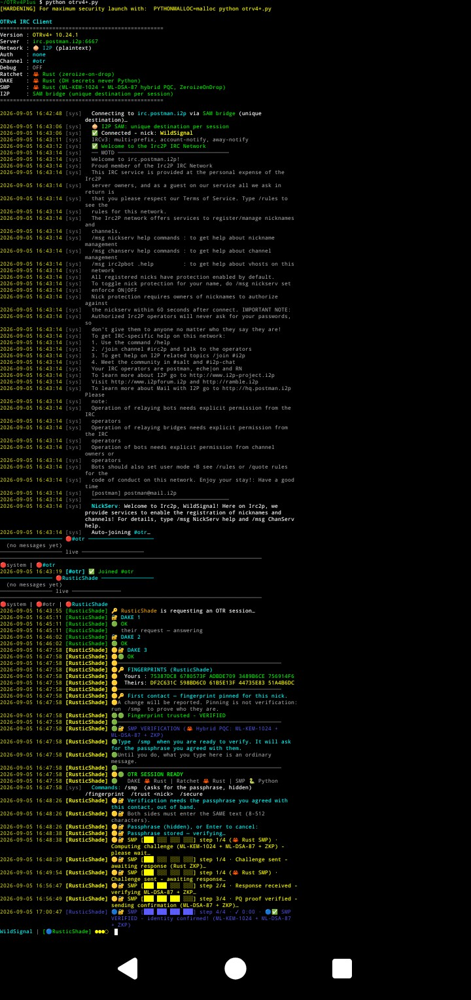

<p align="center">
  
</p>

<h1 align="center">OTRv4+</h1>
<p align="center"><strong>Post-quantum hybrid encryption for Off The Record (OTR) chat <em>and voice calls</em> over IRC and XMPP. Experimental, unaudited research prototype.</strong></p>

<p align="center">
<code>v10.22.0 · Rust crypto core · chat (X448 + ML-KEM-1024, AES-256-GCM) · hybrid PQC SMP (ML-KEM-1024 + ML-DSA-87 + ZKP) · voice (X448 + ML-KEM-1024, AES-256-GCM) · I2P SAM · AAudio · TUI</code>
</p>

---

## In action

<p align="center">
  
</p>

<p align="center"><em>Full OTRv4 DAKE + SMP verification with a hybrid PQC layer (ML-KEM-1024 + ML-DSA-87 + classical ZKP). Blue 🔵 = identity confirmed. Tested live on both Libera.chat TLS and irc.postman.i2p I2P SAM, and over XMPP with the same Rust crypto core.<br>Ctrl+P or Ctrl+S to pause and scroll back. Type <code>/tui</code> to toggle pinned chrome.</em></p>

---

## What this is

OTRv4+ is an IRC and XMPP client that implements OTRv4 with a post-quantum hybrid layer added at each stage of the protocol, including the SMP identity-verification step and, as of v10.11.0, encrypted voice calls carried over I2P — which as of v10.12.0 detect, diagnose and recover from a media path that stops. It runs on Termux (Android) over I2P, Tor, or TLS clearnet, with a Rust crypto core wrapped by a thin Python orchestration layer.

Hybrid classical + post-quantum cryptography: X448 with ML-KEM-1024 for key
agreement, Ed448 with ML-DSA-87 for authentication, keying established
AES-256-GCM for the message itself. OTR's Ed448 ring-signature deniability is
retained rather than traded away for the post-quantum half.

What actually encrypts a message, top to bottom:

```
        X448  +  ML-KEM-1024              key agreement (DAKE)
  Ed448 ring signature  +  ML-DSA-87      authentication: deniable, then hybrid PQ
                  |
                  v
      OTRv4+ double ratchet               a fresh ML-KEM-1024 exchange at
      SHAKE-256 key schedule              EVERY DH ratchet step, not just once
                  |
                  v
             AES-256-GCM
                  |
                  v
       encrypted OTR message
```

Two things that chain is easy to draw wrong. **Ed448 ring signatures are not
optional decoration** — they are what makes the authentication deniable, which
is the property OTR exists for; ML-DSA-87 is added alongside them, not instead
of them. And **the KEM is not a one-time handshake step**: OTRv4+ re-runs a
fresh ML-KEM-1024 exchange at every DH ratchet step, rotating the brace key
that feeds the SHAKE-256 schedule. That placement is the difference from
PQXDH, which applies the KEM to the initial agreement; it is not a claim to be
"more post-quantum" than Signal.

SMP sits beside this chain rather than inside it. It has no AES of its own —
see [Hybrid PQC SMP](#hybrid-pqc-smp-v1091) — but every SMP message travels as
a TLV through the ratchet above, so it is AES-256-GCM in transit like anything
else.

**Single-author research prototype. Not a finished product, and not audited.** The author is not a cryptographer. The protocol composition (the DAKE wiring, the hybrid SMP construction) has had no external review, and the Rust crypto crates it depends on (`ed448-goldilocks-plus`, `x448`, `pqcrypto-mlkem`, `pqcrypto-mldsa`) have had no formal review either. Use it to study or extend, not because you need a hardened tool today. If your safety depends on the security of your messaging, use something audited.

## Authorship

This codebase is AI-generated. The author has not personally written the Rust or Python in this repository and is not a software engineer by trade. What the author brings is years of hands-on experience with PGP, Qubes OS, and adjacent privacy and security tooling, used to direct the design, drive the debugging, and run the live two-peer testing that each change had to pass before being committed. Claude (Anthropic) wrote the implementation under that direction.

This is a real distinction from a project where an experienced cryptography engineer personally authored the code. Strong familiarity with security tools is not the same skill as being able to read and audit a hybrid SMP construction or a DAKE state machine line by line, and this README does not pretend otherwise. Read the rest of this document, and especially the Honest caveats section, with that in mind.

## Where it fits

OTRv4+ occupies a narrow niche. Here is roughly where it sits relative to other tools, accurate to the best of the author's knowledge; corrections welcome:

| | OTRv4+ | Signal | Stock OTRv4 | Matrix/Element |
|---|---|---|---|---|
| Identifier required | None (IRC nick / XMPP JID) | Phone number | None | Email/phone |
| Transport | IRC or XMPP over I2P / Tor / TLS | Centralised servers | IRC/XMPP | Centralised homeservers |
| Post-quantum KEM | ML-KEM-1024, every DH ratchet step | ML-KEM-1024, initial handshake (PQXDH) | None | None |
| Post-quantum signatures | ML-DSA-87 | No | No | No |
| Post-quantum SMP | Yes (hybrid) | N/A (no SMP) | No | No |
| Deniable auth | Ed448 ring signatures | Yes (X3DH/PQXDH) | Yes | No |
| Network-layer anonymity | I2P (new destination per session) | No | Depends | No |

**The niche:** synchronous, pseudonymous, end-to-end encrypted conversation — chat and voice — where both parties are online, no phone number or account exists, the network layer hides your IP, and Category-5 post-quantum parameters are used throughout, including the SMP identity check and the voice media key. Whether that hardening holds depends on the construction being correct, which has not been reviewed.

On the KEM row, since it is easy to get wrong: Signal's PQXDH also uses ML-KEM-1024, so both are at the same parameter level. The difference is *placement* — PQXDH applies the KEM to the initial key agreement; OTRv4+ re-runs a fresh ML-KEM-1024 exchange at every DH ratchet step, in SMP, and per voice call and rekey. That is the distinction; it is not a claim to be "more post-quantum" than Signal.

Signal is faster, asynchronous, and the right choice for almost everyone. OTRv4+ is for sessions where you want a pseudonymous, account-free channel over an anonymising network with a shared-secret identity check, and will pay the latency: a full hybrid-PQC handshake takes ~15 minutes over IRC/I2P, or about a minute over XMPP. See [WHY.md](WHY.md).

## Quick start

For someone who wants to try it in about ten minutes on Termux (Android, aarch64).

### 1. Install dependencies

```bash
pkg install python rust openssl clang git
pip install argon2-cffi
```

`argon2-cffi` is not optional in practice. Without it the at-rest key
derivation for stored SMP secrets and the sealed identity falls back to scrypt
— which still works and warns loudly on every derivation, but is not
memory-hard. The warning names the remedy; there is currently no command that
reports the backend after the fact, so if you scrolled past it, the safe
assumption is that you are on scrypt until you have installed this and
restarted.

Python **3.12 or newer** is required — `otrv4+.py` uses PEP 701 f-string syntax
that does not parse on 3.11, so an older interpreter fails with a `SyntaxError`
inside an import rather than a clear message.

For **voice calls**, two more:

```bash
pkg install libopus termux-api       # the Opus codec, and Termux:API for the ringer
pip install opuslib                  # the Python binding to libopus
```

The Termux package is `libopus`, not `opus` — `pkg install opus` fails with
*Unable to locate package*.

Chat needs neither. Voice needs no Python cryptography library: since v10.13.2
the whole voice key path — media AES-256-GCM, the HKDF-SHA512 schedule and the
X448 exchange — runs inside `otrv4_core`. Earlier revisions of this section
told you to `pip install cryptography` for voice; that is no longer true, and
`cryptography` is now only needed to run the **test suite**, where
`tests/test_voice_rust_parity.py` uses it to build an independent reference
derivation to check the Rust one against.

For **clearnet/TLS** (fastest, no extra setup):
```bash
python otrv4+.py -s irc.libera.chat
```

For **I2P** (strongest anonymity): you need I2P running with the SAM bridge enabled on port 7656. The I2P Android app from F-Droid or Google Play handles this; enable "Use SAM bridge" in its settings.

For **Tor**: Orbot must be running with SOCKS5 on port 9050.

### 2. Clone and build

```bash
git clone https://github.com/muc111/OTRv4Plus.git
cd OTRv4Plus

# Build the Rust crypto core (about 3 minutes on a modern phone)
cd Rust
cargo build --release --features extension-module,pq-rust
cp target/release/libotrv4_core.so ../otrv4_core.so
cd ..
```

**Run cargo from inside `Rust/`**, as above. `Rust/.cargo/config.toml`
supplies a build fix for musl targets (Alpine and similar), and cargo only
finds that file by walking up from the directory it is invoked in — so
`cargo build --manifest-path Rust/Cargo.toml` from the repository root will
skip it and fail. See [Building on musl](#building-on-musl) below.

The `extension-module` feature is explicit as of v10.11.1. It was previously in
`default`, which told PyO3 not to link libpython — correct for the `.so`, and
fatal for anything else. It meant `cargo test` failed at link time, so all 35
unit tests in the crate had never been executed. Moving it out of `default`
costs one flag on the build line and makes the test suite reachable.

As of v10.7.5 there are no C extensions to compile. The **chat** path is Rust-core-only: every cryptographic operation behind messaging runs inside `otrv4_core`.

The **voice** path was the exception until v10.13.2, and this paragraph used to say so. `otrv4plus_voice.py` used the Python `cryptography` library for the media AES-256-GCM, the HKDF-SHA512 voice key schedule and the X448 half of the voice key exchange — so there were two AES-256-GCM implementations in the tree and "one cryptographic surface" would have been false. All three moved into `otrv4_core` at v10.13.2: the epoch root is `SecretBytes<64>` behind a handle with no accessor, media keys are `SecretBytes<32>` with no getter, and the X448 private scalar is `SecretBytes<56>`, single-use. `_require_rust_voice()` is a hard requirement with no Python fallback, because falling back would restore exactly what was removed.

So voice no longer needs `cryptography` at run time, and the library is a **test** dependency rather than a runtime one. What remains Python-side in the voice path touches no key material: the frame header, the AAD construction, the replay window, the jitter buffer and the rekey state machine.

### Building on musl

On Alpine, or any musl toolchain, the build fails before compiling a single
line of Rust:

```
pqclean/common/compat.h:20:21: error: missing binary operator before token "("
   20 | #  if !__GNUC_PREREQ(7, 1) // at least GCC 7.1
error: failed to run custom build command for `pqcrypto-mlkem v0.1.1`
```

Nothing is wrong with your checkout. `pqcrypto-mlkem` vendors PQClean, whose
`compat.h` includes `<features.h>` and then uses `__GNUC_PREREQ` — a **glibc**
macro. musl ships a `<features.h>` that does not define it, so the
preprocessor meets an undefined identifier followed by `(`, which is not a
valid `#if` expression. It is an upstream assumption, and there is no fixed
release to move to: 0.1.1 is the newest `pqcrypto-mlkem` published.

**`Rust/.cargo/config.toml` already fixes this** for the four common musl
triples, by supplying the macro with a definition equivalent to glibc's own.
It is keyed per-target, so a glibc build never sees it. Just run cargo from
inside `Rust/` so the file is found.

**And no `libotrv4_core.so` is produced.** Once the compile succeeds, musl
hits a second problem, which is quieter than the first because the build
*succeeds*:

```
$ cp target/release/libotrv4_core.so ../otrv4_core.so
cp: cannot stat 'target/release/libotrv4_core.so': No such file or directory
$ ls target/release/libotrv4_core.*
target/release/libotrv4_core.d    target/release/libotrv4_core.rlib
```

musl targets enable `crt-static` by default, and rustc cannot build a cdylib
against a statically linked C runtime — so it drops the crate type, mentions
it in one line among the compile output, and exits 0. The `.so` this whole
step exists to produce simply is not there.

`Rust/.cargo/config.toml` turns `crt-static` off for the musl triples, which
restores it. The resulting `.so` links musl dynamically, which is what a musl
Python needs to load it. If you have bypassed that file, `build.rs` says so
rather than letting the `cp` fail unexplained, and you can pass the flag
directly:

```bash
RUSTFLAGS="-C target-feature=-crt-static" \
  cargo build --release --features extension-module,pq-rust
```

**`cargo test` on Alpine needs the same flag.** Without it the test binary is
linked `-static-pie` and the linker asks for a static libpython that Alpine
does not ship:

```
cannot find -lpython3.12: No such file or directory
have you installed the static version of the python3.12 library ?
```

The test binary links libpython on purpose — that is why `extension-module`
is not in `default` — so it needs a *dynamic* link to find
`libpython3.12.so`. Running cargo from inside `Rust/` covers this too.

If you would rather not rely on that file, build with clang — the clang branch
of that header avoids `__GNUC_PREREQ` entirely:

```bash
CC=clang cargo build --release --features extension-module,pq-rust
```

or supply the macro yourself for one build:

```bash
CFLAGS='-D__GNUC_PREREQ(maj,min)=((__GNUC__>(maj))||(__GNUC__==(maj)&&__GNUC_MINOR__>=(min)))' \
  cargo build --release --features extension-module,pq-rust
```

The definition has no spaces on purpose: `cc-rs` splits `CFLAGS` on
whitespace.

### 3. Verify the build (recommended)

```bash
cd Rust
cargo test --lib            # 65 tests (the SMP tests are 3072-bit DH)
cargo test --lib ratchet    # 26 ratchet tests, about a second
cd ..
```

Expected: `test result: ok. 65 passed; 0 failed`. Four groups matter most:

| Test | Checks |
|---|---|
| `test_vectors::ed448_rfc8032_vectors_byte_exact` | Rust Ed448 against RFC 8032 §7.4 |
| `key_handles::x448_rfc7748_known_answer` | Rust X448 against RFC 7748 §5.2 |
| `smp::pq_smp_matching_secret_verifies` | Full hybrid PQ SMP round trip |
| `ratchet::forged_frame_does_not_desync_the_receive_chain` | RT-1 regression (see Security fixes) |

What these tests do and do not tell you: a pass confirms the **primitives** (Ed448, X448) match their published RFC vectors byte-for-byte, so the low-level math is implemented correctly. It does **not** certify the surrounding protocol: the DAKE wiring and the hybrid SMP construction are unreviewed, and no test here can establish that they are secure. Treat a green run as "the building blocks are correct," not "the system is safe."

### 4. Run it

```bash
PYTHONMALLOC=malloc python otrv4+.py --debug
```

You should see the banner, the I2P SAM bridge handshake, the IRC connection to `irc.postman.i2p`, an auto-join of `#otr`, and a prompt. Other users in `#otr` running the same client are available for an OTR session.

### 5. Talk to a peer

If another user is in `#otr` (their nick is `SomeNick`), type:

```
/otr SomeNick
```

This starts the OTRv4 DAKE handshake. Fingerprints display once the DAKE completes. Type `y` to trust. Either side then types a shared SMP secret (agreed out of band) and runs `/smp start`.

Typical completion times (measured, hybrid PQC SMP v10.9.1):
- **TLS clearnet** (Libera.chat): DAKE + SMP verified in **under 6 minutes**
- **I2P SAM** (irc.postman.i2p): DAKE + SMP verified in **~15–16 minutes** (fragment rate limiting required due to server flood policy)
- **Tor**: 8–12 minutes (estimated)

You see `✅ SMP VERIFIED` in blue when done.

From that point, messages typed in the peer tab are end-to-end encrypted with the hybrid post-quantum scheme.

## XMPP transport

`otrv4plus_xmpp.py` runs the exact same DAKE, SMP, and double-ratchet implementation in `otrv4_core` over XMPP instead of IRC. It is a separate harness built on `slixmpp`; everything in this README under Architecture, Key exchange, and Hybrid PQC SMP is the identical underlying engine. Only the network transport differs.

### Running it

```bash
python otrv4plus_xmpp.py \
  --jid alice@<vhost>.b32.i2p \
  --server <c2s-tunnel>.b32.i2p \
  --peer bob@<vhost>.b32.i2p \
  --debug
```

#### No `--insecure-tls`, and why

Nothing above passes it, because over I2P nothing needs it.

A `.b32.i2p` address is the SHA-256 of the server's destination key: reaching
that address means reaching that key-holder, over I2P's own end-to-end
encryption, or not connecting at all. There is no certificate authority in the
path and no MITM position for one to defend against. The same is true of a v3
`.onion` name over Tor, which *is* the server's public key.

So the client decides by transport rather than by flag:

| Server | Certificate check |
|---|---|
| `.b32.i2p` over I2P | skipped — the address authenticates the endpoint, and the client says so |
| `.onion` over Tor | skipped — same reason |
| clearnet | **required**, and only `--insecure-tls` disables it, with a warning |

The flag still exists for a clearnet server with a self-signed certificate.
It is no longer part of any normal command, which matters: a flag with
"insecure" in it, typed daily for a link that is not insecure, teaches a habit
that is genuinely dangerous the first time someone carries it to a clearnet
host.

**A certificate would not add much here.** It proves possession of a key, not
that a server is uncompromised — an attacker who took the server holds the key
too and serves the same certificate. Certificates detect *substitution*, and
substitution is what the b32 already prevents. No public CA issues for `.i2p`
in any case, since it is outside the public DNS namespace.

#### Not typing the b32 every time

`.i2p` names are **not DNS**. A router resolves only the names in its own
address book, which it builds from subscriptions, and a private server is in
nobody's subscription — so `xmpp-elite.i2p` resolves on the machine that
created it and nowhere else, while the 52-character `.b32.i2p` form works
everywhere because it *is* the destination hash. That is why the long form has
to be pasted, and it is unreasonable on a phone keyboard.

**The project's own server is already in the box.** `i2p_hosts.defaults`
ships with the source, so a fresh clone connects with the short name and never
sees a b32:

```bash
python otrv4plus_xmpp.py --jid alice@xmpp-elite.i2p \
                         --peer bob@xmpp-elite.i2p
```

That file is also how a **server move** reaches people. Ship a new line, users
`git pull`, and the same command they have always run reaches the new address.
Delete its contents if you would rather trust nothing shipped — everything
still works with an explicit `--server`.

**Precedence, and why.** `~/.otrv4plus/i2p_hosts` is yours and an update never
edits it. A line you wrote by hand always wins: you meant it. A line the
client *learned* by itself, marked `# learned`, yields to a changed shipped
default and says so — otherwise your first successful connection would pin an
address forever and a server move would strand you.

**The client writes this for you.** The first time a connection to a
`.b32.i2p` server succeeds, the mapping from your JID's domain to that
destination is recorded automatically, and it says so:

```
[i2p] recorded xmpp-elite.i2p = hq4t24b7…q.b32.i2p in ~/.otrv4plus/i2p_hosts
[i2p] next time:  --jid bob@xmpp-elite.i2p --peer <peer> (no --server needed)
```

It records only after the connection worked, because that is the only moment
the pair is known to be good. If the name is already recorded against a
*different* destination it is left alone and reported — a server that moved is
something you should see, not something the client quietly adopts.

Or write it by hand, in `~/.otrv4plus/i2p_hosts`:

```
# name = destination
xmpp-elite.i2p = hq4t24b7vkllfbk55e5xfocqhfi7hxprwc47zyuilbg6wgzikidq.b32.i2p
```

Then the address is the JID's own domain and **`--server` is no longer
needed**:

```bash
python otrv4plus_xmpp.py \
  --jid alice@xmpp-elite.i2p \
  --peer bob@xmpp-elite.i2p
```

The client prints the substitution when it uses one, so you always see which
destination you actually reached.

**What an alias is, and is not.** It is a note to yourself about what a name
means on this device. It is not authenticated, it is not published, and it
proves nothing about who answers. Nothing about the security of a conversation
rests on it: the DAKE authenticates the peer and TOFU pins their identity key,
so pointing an alias at the wrong server gives you a failed connection or a
server that cannot read anything — not a silent impersonation. An address
given in full as `.b32.i2p` is never looked up in the file, so a local file
cannot redirect an address you spelled out.

**The client never touches i2pd's own address book.** That format varies
between versions, the daemon owns and rewrites those files, and a bad write
would break name resolution for every I2P application on the device rather
than just this one — so the alias file is ours, in our directory, and the
router's is left alone.

The alternative, if you would rather every I2P application on the device knew
the name, is the router's own address book (`i2pd`: an entry under
`~/.i2pd/addressbook/`), edited by you. Publishing a name properly, so that *other* people's
routers resolve it, means registering it with an I2P naming service — a
server-operator task, with propagation delay, and out of scope for the client.

`--sam-host` / `--sam-port` point it at an I2P-hosted XMPP server through the same SAM bridge setup as the IRC client. `--no-i2p` connects to a clearnet/TLS XMPP server directly. `--no-tui` switches to plain linear scrollback. `--no-reconnect` disables the reconnect loop. Run `--help` for the full flag list.

### Security hardening (v10.10.4)

The XMPP harness received a full production hardening pass. Every change is in `otrv4plus_xmpp.py`; the Rust core is unchanged.

**Subscription approval gate.** `auto_authorize` and `auto_subscribe` are both `False`. All incoming subscription requests are queued in `_pending_subscriptions` and require an explicit `/accept <jid>` or `/deny <jid>` before presence is shared. Previously the client auto-approved all subscription requests, which would allow a hostile JID to silently add itself as a contact.

**Per-peer rate limiting.** Inbound messages are capped at 20 per peer per 5-second window. Messages exceeding the limit are dropped with a `[rate-limit]` notice. Implemented via a per-peer `collections.deque` of monotonic timestamps; no state persists across reconnects.

**SMP secret validation.** Passphrase length is checked before passing to the Rust engine: minimum 8 characters, maximum 512 characters. Applied in `store_smp_secret`, `smp_start`, and `_handle_smp_secret_answer`. Previously any non-empty string, including a single space, was accepted.

**Session-local block list.** `/block <jid>` drops all inbound messages from a JID without processing or displaying them. The block is checked before the rate limiter and before OTR processing. Session-local only; clears on exit. `/unblock <jid>` and `/blocked` manage the list.

**XEP plugins.** Plugins registered in `__init__` alongside existing XEP-0030 and XEP-0085:

| Plugin | Purpose |
|--------|---------|
| XEP-0115 | Entity capabilities — efficient feature advertisement to peers |
| XEP-0184 | Delivery receipts (auto mode: requests and sends receipts) |
| XEP-0198 | Stream management — stanza acks; graceful degradation if server lacks support |
| XEP-0199 | XMPP Ping — available for `/ping <jid>` on demand |

XEP-0198 registration is wrapped in `try/except`; if the server does not advertise stream management the plugin silently disables, the session continues, and no exception surfaces to the user.

**Automatic reconnect (I2P-aware).** On disconnect, the client waits with exponential backoff (5 s base, 300 s ceiling) then re-establishes the I2P SAM tunnel via `start_i2p_sam_forwarder` before reconnecting slixmpp. SAM parameters are stored as `_sam_params` before the first connect so they are available to the reconnect loop. A `_shutting_down` flag prevents reconnect loops on `/quit`, Ctrl+C, or authentication failure. `--no-reconnect` disables the feature entirely.

**Presence state.** `_on_presence_available` and `_on_presence_unavailable` handlers print when a peer comes online or goes offline, with optional status text sanitised through `_sanitise()`.

**Delivery receipts.** `_on_delivery_receipt` fires when a peer acknowledges message delivery (XEP-0184), printing `[receipt] delivered to <jid> (id <msg_id>)`.

### XMPP commands

All commands work identically in TUI and `--no-tui` mode.

```
/otr [jid]            start OTR session (DAKE)
/smp                  verify this session — prompts (hidden) if no passphrase
                      is stored, then verifies. The only SMP command you need.
/smp start            same as /smp
/smp <secret>         set the passphrase inline and start (ECHOED — prefer /smp)
/smp-secret           store a passphrase without verifying (prompts, hidden)
/smp-secret <s>       store it inline (ECHOED — advanced/compat form)
/trust                re-show fingerprint trust prompt
/msg <jid> <text>     send plaintext message (no OTR)
/status               show session + trust + SMP state
/roster               list roster contacts with subscription state
/add <jid>            add contact and send subscription request
/remove <jid>         remove contact from roster
/pending              list pending subscription requests
/accept <jid>         approve a pending subscription request
/deny <jid>           reject a pending subscription request
/block <jid>          block inbound messages from JID (session-local)
/unblock <jid>        unblock JID
/blocked              list blocked JIDs
/ping <jid>           XMPP ping via XEP-0199 (prints RTT)

/call [jid]           place an encrypted voice call
/answer               accept an incoming call
/reject               decline an incoming call
/hangup               end the active call
/mute                 toggle the microphone (stays constant-rate on the wire)
/calls  /callstatus   call state, epoch, audio backend, packet counters
/voicedebug  /vdebug  per-call diagnostics every 5 s
/smpstate             engine SMP state and whether calls are permitted
/audioprobe           test each audio backend on this device
/audiotest            verify the microphone captures real samples

/next  /prev          switch tabs (TUI)
/win <n|name>         jump to tab by number or name prefix
/tabs                 list open tabs
/clear                clear active tab history
/close                close active tab
/help                 full command list in-session
/quit                 disconnect and exit
```

### What has been verified live

Two-peer testing over a Prosody server reachable via I2P SAM (`.b32.i2p` addresses):

- Full three-message DAKE (DAKE1 → DAKE2 → DAKE3) completes
- Fingerprints display and the trust prompt works
- Hybrid PQC SMP completes all four steps to `VERIFIED` (ML-KEM-1024 + ML-DSA-87 + classical ZKP)
- Messages encrypt and decrypt correctly in both directions after verification
- Simultaneous DAKE (both peers start `/otr` before either DAKE1 arrives) resolves deterministically by bare JID without deadlocking

**Measured run, both peers over I2P SAM:**

| Event | Time |
|---|---|
| `/otr` issued, DAKE1 sent | 00:27:55 |
| SMP secret prompt shown (DAKE complete, fingerprint trusted) | 00:28:13 |
| SMP step 4/4, `VERIFIED` | 00:29:03 |
| **DAKE start to SMP verified** | **1m 08s** |

A second live run measured 1m 15s end to end. That is roughly 13–14× faster than the IRC client's ~15–16 minutes over the same I2P network. The speed difference is entirely the IRC fragment rate limit: `irc.postman.i2p` enforces strict flood limits so the IRC client paces sends at 2 fragments then a 6-second pause; SMP2 alone spans ~49 fragments. The XMPP path carries multi-kilobyte stanzas directly and fragments only above ~6 KB (I2P streaming cliff), so the same crypto payload transits in far fewer round trips.

XMPP support is newer than IRC and has had fewer live runs. Treat it as more experimental until it accumulates more testing.

## Encrypted voice calls

Voice runs the same Rust crypto core as chat, over the same I2P transport,
gated behind the same SMP verification. A call is refused unless the engine's
own cryptographic predicate says the peer is verified — not a badge, not a log
line.

### Why this is unusual

Encrypted calling apps are common; the combination here is not.

- **The media never touches a carrier.** Audio goes endpoint → I2P → endpoint.
  No PSTN leg, so no call detail record exists anywhere.
- **Neither party learns the other's IP.** Each side publishes a transient I2P
  destination for the call and tears it down afterwards. The XMPP server sees
  encrypted signalling stanzas; it never carries audio.
- **The media key is hybrid post-quantum.** X448 **and** ML-KEM-1024, both
  mandatory. An adversary recording the call must break both to recover it
  later. Most encrypted-calling systems are classical-only on the media key.
- **No phone number anywhere.** Identity is an XMPP JID on an I2P vhost,
  verified by SMP against a secret agreed out of band.

### Compared with a carrier call

| | Carrier (GSM/VoLTE) | OTRv4+ |
|---|---|---|
| Encryption scope | Handset ↔ tower; the carrier decrypts | End to end; keys never leave the devices |
| Carrier can listen | Yes, by design — lawful intercept | No carrier involved |
| Call detail records | Who, whom, when, duration, cell site | None created |
| Interconnect attacks | SS7/Diameter tracking and interception | Not applicable |
| IMSI catchers | Can force downgrade and intercept | Not applicable |
| Identity anchor | Phone number, KYC-bound | Ephemeral JID |
| Post-quantum media | No | X448 + ML-KEM-1024 |

A carrier call reaches any number on earth, reaches emergency services, and has
a fraction of the latency. This is not a phone replacement — it is a way for
two people who both already run OTRv4+ to talk without a third party in the
middle.

### Media key derivation

```
transcript = LP("OTRv4+Voice/v3") || LP(call_id) || LP(otr_binding)
          || LP(fp_low) || LP(fp_high)                  # sorted — symmetric
          || LP(x448_initiator) || LP(x448_responder)   # role-ordered
          || LP(mlkem_ek) || LP(mlkem_ct) || u64(epoch)

ikm  = LP(x448_shared) || LP(mlkem_shared)              # both mandatory
salt = SHA-512("OTRv4+Voice/Salt/v3" || transcript)
root = HKDF-SHA512(ikm, salt, "OTRv4+Voice/Initial/v1" || transcript)
```

`LP(x)` is a 4-byte big-endian length prefix followed by `x`. Every field is
prefixed, so no two distinct field sets serialise identically — unprefixed
concatenation is re-partitionable, and a short `ssid` followed by a long
fingerprint would hash the same as the reverse.

The fingerprint pair is **sorted** because each endpoint sees its own as
"local"; the X448 publics are **role-ordered** (initiator first) rather than
local/remote. Getting either wrong makes the two sides build different
transcripts and derive different roots, which is what the earlier
"media keys did not agree" failure was.

Directional keys:

```
K_dir = HKDF-SHA512(root, salt=call_id,
                    info="OTRv4+Voice/Media/v1" || LP(call_id)
                         || u64(epoch) || dir_byte)
```

`dir_byte` is `0x01` initiator→responder, `0x02` reverse. The endpoints never
share an encryption key, so both counters can start at zero safely. A single
bidirectional key with two counters from zero would give identical key+nonce
on different plaintexts, leaking the plaintext XOR and GHASH's `H`.

Confirmation is two-way and role-labelled: the responder proves possession in
ACCEPT, the initiator in CONFIRM. Audio cannot start before both verify.

### Media frame

```
off  0  sync        u8    0xA7
off  1  version     u8    0x03
off  2  frame_type  u8    0x01 (AUDIO — the only value ever sent)
off  3  epoch       u64 BE
off 11  counter     u64 BE
off 19  length      u16 BE
off 21  ciphertext || GCM tag

AAD   = "OTRv4+Voice/AAD/v3" || LP(call_id) || dir_byte || header[0:21]
nonce = u32BE(epoch mod 2^32) || u64BE(counter)     derived, not transmitted
```

Every header field is inside the AAD: flipping the epoch, counter, length or
frame type causes a tag failure. `dir_byte` is **not** on the wire — the
receiver supplies the peer's direction locally, so a frame reflected back at
its own sender fails authentication. The nonce is derived from authenticated
fields rather than sent, costing no bytes and removing a tamper surface.

Constant 279-byte packet, one every 60 ms — 16.7 packets/s, 37.2 kbit/s on the
wire — for the whole call. Muting encodes digital silence rather than stopping
transmission, so it is invisible to anyone counting packets. Both the frame
length and the bitrate are wire-format settings: peers that disagree establish
a call, report it healthy, and carry no audio. See
[Rust/VOICE_TUNING.md](Rust/VOICE_TUNING.md).

### Key schedule

- **Symmetric ratchet** every 500 frames (30 s at the 60 ms default) — forward secrecy for audio
  already sent. It does *not* give post-compromise recovery; an attacker
  holding the current chain key can step it forward indefinitely.
- **Hybrid rekey** every 120 s: fresh X448 + fresh ML-KEM-1024, chained onto
  the old root. This is where post-compromise recovery comes from.
- **Monotonic 64-bit epoch**, `new == current + 1` enforced. Old, duplicate,
  skipped and future epochs are all rejected.
- **Two-phase commit** (CURRENT → PENDING → CONFIRMED → COMMITTED): a failed,
  replayed or lost rekey costs one rekey and never the call. The previous
  epoch is retained for one epoch so frames already in flight still decrypt.
- **Replay rejection** via a 1024-frame bitmap window per (call, direction,
  epoch) — 128 bytes regardless of call length. Reordering and replay are
  distinct: an unseen counter inside the window is accepted, the same counter
  twice is not.

Every control message (INVITE, ACCEPT, CONFIRM, REJECT, REKEY, REKEYACK,
REKEYCOMMIT, MEDIAPATH, END) carries and is matched against the `call_id`, so
a message from a previous call cannot act on the current one.

**MEDIAPATH** announces a replacement media endpoint after a network
transition. Arriving over the OTR-encrypted signalling channel is not enough
to be acted on: it carries a tag derived from the committed media epoch root,
so producing one requires the media secret rather than write access to
signalling. The tag covers the call, the epoch, a strictly increasing
sequence, the destination and the direction — so a forged, reflected,
replayed or rolled-back announcement cannot move where audio is sent. See
`VOICE_MEDIA_PATH.md`.

### Audio backend

Voice does **not** use PulseAudio. On Android it drives **AAudio**
(`libaaudio.so`) through `ctypes`.

`android.media.AudioRecord` is a Java class and needs a JNI attachment to a
live ART VM. Termux runs a plain Linux userland with no JVM, so it is
unreachable from this process. AAudio is the NDK **C** API — the same
AudioFlinger path `AudioRecord` sits on — exposed as plain C symbols, needing
no JVM, no JNI and no second build system.

| Requested | Used |
|---|---|
| `AudioRecord` | `AAudioStream`, `DIRECTION_INPUT` |
| `AudioTrack` | `AAudioStream`, `DIRECTION_OUTPUT` |
| `AudioSource.VOICE_COMMUNICATION` | `AAUDIO_INPUT_PRESET_VOICE_COMMUNICATION` |
| `ENCODING_PCM_16BIT` | `AAUDIO_FORMAT_PCM_I16` |
| `ERROR_DEAD_OBJECT` | `AAUDIO_ERROR_DISCONNECTED` (−899) |

PulseAudio's OpenSL ES modules fail with error 12 (`SL_RESULT_FEATURE_UNSUPPORTED`)
on Android 15, leaving only `auto_null`. PulseAudio remains selectable via
`OTRV4PLUS_AUDIO_BACKEND=pulseaudio` and still backs `/audiotest`, but fallback
is never silent: on a device where it exposes only `auto_null`, a silent
demotion would establish keys, encrypt, and transmit pure silence with every
indicator healthy.

`/audioprobe` reports which backend works, and reports **peak amplitude** — a
byte count cannot distinguish a working microphone from a stream of zeroes, and
zeroes are exactly what a revoked `RECORD_AUDIO` or a null source produces.

**Codec and jitter:**

- Opus 16 kHz mono, 60 ms frames, **24 kbit/s CBR**, DTX off. A 60 ms frame is
  180 bytes in the fixed 232-byte slot. 60 ms was measured against 40 ms and
  20 ms and chosen because I2P charges by the packet, not by the byte: it is
  16.7 packets/s against 25, for 6% less wire bitrate. It costs 20 ms more
  accumulation delay, and one lost packet is 60 ms of audio rather than 40.
  `OTRV4PLUS_OPUS_FRAME_MS` changes it, on both phones together.
- **In-band FEC**, decoded at playout. Recovering a lost frame needs the *next*
  packet, which does not exist at receive time, so the jitter buffer holds Opus
  payloads rather than PCM. A one-frame gap is reconstructed from the
  successor's redundant copy — recovered audio, not synthesised concealment.
  Longer gaps fall back to PLC. This also cuts buffer memory 8×.
- **Adaptive jitter buffer.** RFC 3550 interarrival smoothing with the frame
  counter as sender timestamp (spacing is exactly one frame by construction, so
  any deviation is transit jitter). Target is 3× the estimate plus one frame,
  clamped: 240 ms on a clean path, 600 ms ceiling, and it shrinks back when the
  path recovers.

### Reading the telemetry

`--voice-debug` prints a five-second telemetry block per call. The one-way
figure in the summary line and the mouth-to-ear total in the `budget:` line
are colour-banded so a reading is a verdict rather than a number to interpret:

| Colour | Mouth-to-ear | Meaning |
|---|---|---|
| green | ≤ 400 ms | ITU-T G.114's "acceptable for most user applications" |
| yellow | ≤ 800 ms | noticeable delay, still conversational |
| red | > 800 ms | talk-over territory |

Over three I2P hops in each direction a healthy call reads **red**: the
measured median mouth-to-ear on this path is about **917 ms**. That is above
G.114's 400 ms and above the 800 ms band, and the readout says so rather than
being recalibrated until it looks acceptable. It is the price of the anonymity
configuration, not a fault in the codec — Opus is not the bottleneck (see
[OPUS_AUDIT.md](OPUS_AUDIT.md)), and the playout path contributes a p50 of
about 93 ms during degraded periods. Do not read this figure as ordinary
low-latency VoIP performance; it is a measurement of a three-hop-each-way
anonymising network. Reducing it is open work, and reducing the hop count is
not on the table. Retune without touching
code via `OTRV4PLUS_M2E_GOOD_MS` and `OTRV4PLUS_M2E_WARN_MS`; `NO_COLOR`
disables the banding, and it is suppressed automatically when stdout is not a
terminal, so a redirected transcript stays plain.

### When the media path stops

A call can go silent without anything reporting an error. A datagram handed to
the local SAM UDP bridge is accepted whether or not the session behind it still
exists, so the transmit counters keep climbing over a dead path and the call
looks healthy while carrying nothing. That is what a Wi-Fi-to-mobile switch used
to do to a call.

A watchdog now measures silence since the last frame that **authenticated** —
not since the last datagram that arrived, which a broken path can still produce.
When nothing is arriving at all, the endpoint is replaced: the old SAM session
is closed, a new one is built, and the new destination is announced to the peer
in an authenticated `MEDIAPATH` control message, tagged from the committed epoch
root over the call_id, epoch, sequence, destination and role. A stale, forged or
rolled-back address is rejected. No media key derives from the destination, so
moving the address invalidates no key: epoch, replay windows, ratchet and call
identity all survive untouched, and a packet already accepted stays rejected.
Success is confirmed by inbound media resuming, never by the clock.

Not every silence deserves a new endpoint. A SAM session lives exactly as long
as its control socket, and on a network transition I2P often rebuilds tunnels
*underneath* a session that is still ours — replacing it then throws away a
working session, stops our own transmission for the rebuild, and makes the peer
adopt an address it never needed. So while the control socket is open the
rebuild is held back; while it is closed, nothing changes:

| | warn | rebuild | dead |
|---|---|---|---|
| proven path, session gone | 15 s | 15 s | 45 s |
| proven path, session alive | 15 s | 45 s | 75 s |
| cold path, session gone | 120 s | 120 s | 165 s |
| cold path, session alive | 120 s | 150 s | 195 s |

The warning is never delayed by the hold — you are told at 15 s, and told that a
hold is in effect and why. The dead horizon moves with the hold, so waiting can
never shorten the window a rebuild gets. A cold path, which has never carried
audio, gets the wider grace because an I2P path still coming up is not a broken
one. Worst case from media death to teardown is bounded at 465 s proven / 795 s
cold, computed from the constants by a test that fails if the documentation and
the code disagree. `OTRV4PLUS_RX_SESSION_HOLD_MS=0` disables the hold;
`OTRV4PLUS_RECOVER_ATTEMPTS=0` disables recovery entirely and restores the plain
fail-safe. Full detail in [VOICE_MEDIA_PATH.md](VOICE_MEDIA_PATH.md).

Verified in the field: Wi-Fi off mid-call, authenticated media resumed 51 s later.

### Fingerprints and trust

The two protocols answer the fingerprint question differently, because a JID
and an IRC nick are not the same kind of name.

**XMPP — trust on first use.** Your identity persists across restarts, so the
peer's does too, and a fingerprint that changes is worth knowing about. On first
contact with a JID the fingerprint is shown and pinned automatically. After that
a matching fingerprint says so. **You are never asked to approve a fingerprint**
— faced with one you have never seen there is nothing to check it against, so
the only available answer is yes, and a question always answered yes trains the
reflex that makes the one that matters useless.

If the fingerprint **changes**, the session stops there:

```
!!!!!!!!!!!!!!!!!!!!!!!!!!!!!!!!!!!!!!!!!!!!!!!!!!!!!!!!!!!!
[trust] THE FINGERPRINT FOR THIS JID HAS CHANGED.
[trust]   pinned : ....
[trust]   now    : ....
[trust] The pinned fingerprint has NOT been replaced.
```

The stored pin is not overwritten, SMP setup does not continue, and voice is
refused for that peer. There is no keystroke that waves this through. Accepting a new identity is a
separate, typed, peer-named action: `/trust-reset <jid>`. That asymmetry is the
point — a prompt answerable with the keystroke you already press reflexively is
not a decision.

It also looks exactly like your peer reinstalling, so it is a question and not a
verdict. Confirm the new fingerprint with them over a channel that is not this
one before clearing the pin.

**IRC — nothing is pinned.** The identity is regenerated every run by design, so
a fingerprint pinned to a nick is pinned to nothing. Your `y` holds for the rest
of the session and is not written to disk. Before v10.12.0 IRC *did* write
those records, which meant the second session with any peer raised a fingerprint
mismatch and printed a MITM warning as normal behaviour.

**Neither is authentication.** A matching pin tells you the identity did not
change; it does not tell you who it belongs to. SMP does that, and SMP remains
the only thing that authorises a voice call.

### Abandoned OTR sessions

A ratchet is shared state, so when the peer's client exits their half is gone
and ours is not — and the next `/otr` found a live session on this side only.

A peer that goes offline and stays offline for `PEER_GONE_SECONDS` (180 s) now
has its session cleared automatically, so `/otr` starts cleanly when they come
back. The trigger is deliberately *not* "the peer went offline": over I2P this
client reconnects often, and our own stream dropping produces the same presence
for every peer. The timer is cancelled by anything proving the peer is still
there — a presence, any inbound message — and by our own disconnect. A peer on
a live call is never torn down, because media does not use XMPP and ending OTR
would take the rekey and END signalling with it.

Only session state goes: the ratchet, the SMP result, the DAKE. The **pinned
fingerprint is kept** — that is long-term identity, and forgetting it would
turn every reconnect into a fresh trust-on-first-use decision, which is exactly
where a MITM would want the user.

### Incoming calls on Android

The phone is usually screen-off and face-down when a call arrives, and a tone
from a backgrounded terminal is easy to miss. So an incoming call rings three
ways at once: a synthesised double-ring through the same audio backend the
call will use (no audio file is ever read or written), a Termux:API
notification at max priority, and an 800 ms vibration.

The notification carries **Answer** and **Decline** buttons. A Termux
notification action is a shell command run by the Termux app in its own
process, so the button cannot call into the client directly. It writes one
line into a FIFO at `~/.otrv4plus/call-ctl` (directory `0700`, pipe `0600`)
which the client is reading, and that line resolves to exactly the
`answer_call()` / `reject_call()` the terminal calls. There is no second state
machine and no second code path.

Three properties make that safe:

- **No peer-derived text ever reaches a shell command.** The action string
  contains only a path we chose and a token we generated. The peer's JID goes
  in the notification *body*, where it is stripped of ANSI and control
  characters and de-fanged so `termux-notification` cannot parse it as one of
  its own options.
- **The token is single-use and bound to one `(peer, call_id)`.** A replayed
  press finds it spent; a press left over from an earlier call cannot answer
  the call that replaced it.
- **Every press is re-checked against live session state** on the event loop.
  A press that lands after the caller hung up, the timeout fired, or the
  terminal already answered does nothing.

The buttons appear only on Termux with Termux:API installed. Everywhere else
the notification is posted exactly as before and no FIFO is created — there is
no partial mode, because a button that cannot be delivered is worse than no
button. `OTRV4PLUS_RING_PRIVACY=1` replaces the JID with "Open Termux to
answer" so nothing identifying reaches the lock screen.

A button is not a way past verification. Ringing happens downstream of the SMP
gate: `_on_invite` refuses to allocate a session at all for a peer SMP has not
verified, so a notification can only ever act on a call the client had already
decided to ring.

### Microphone access

No remote message can open the microphone. Only `start_audio()` opens the
device, and only `_await_media` (after a local `/call`) and `answer_call`
(after a local `/answer`, or a local press on the notification's **Answer**
button) reach it. Ringing opens playback only. This is enforced by a test that
enumerates every caller, not by inspection.

`/mute` **closes the capture stream** rather than reading and discarding. The
OS recording indicator goes out. A soft mute leaves the microphone open — the
OS still routes audio into the process, and anything that compromised it could
read the buffer.

### Honest limits

- **Latency.** Two I2P tunnels, three hops each way. Usable for conversation,
  not snappy.
- **Metadata is reduced, not eliminated.** Constant-rate shaping removes
  speech-dependent packet size and timing. Call start, end, duration, tunnel
  behaviour, loss and congestion remain observable, and the XMPP server still
  sees that two JIDs exchanged encrypted stanzas.
- **Authentication is only as post-quantum as the DAKE.** The ephemeral voice
  keys are authenticated by the surrounding OTR channel. A quantum adversary
  able to forge that authentication *in real time* could MITM a live call;
  recorded calls stay protected by ML-KEM-1024.
- **Echo** when both endpoints are speaker-out in one room. I2P adds hundreds
  of ms each way; echo cancellers are built for tens.
- **Requires `RECORD_AUDIO` held by the Termux app itself.** Termux:API holding
  it is not enough — this process runs under Termux's UID.
- **Both ends must run v10.11.0+.** The voice wire format changed; older builds
  are rejected cleanly by the version byte rather than producing garbled audio.

## TUI mode

OTRv4+ includes a built-in terminal UI that pins a tab bar and input line at the bottom of the screen, keeping your chat history visible above it (useful on mobile where screen space is limited).

```
22:11:29 🔵CobaltBear: works
22:11:30 🔵WildTallow: nice
22:13:57 🔵WildTallow: ok
─────────────────────────────────────────────────────────
WildTallow | [🔵CobaltBear]
[system🔴(1)] | [debug🔴(6929)] | [#otr🔴(1)] | [CobaltBear🔵]
```

**Toggle it on or off:**

```
/tui
```

Or explicitly:

```
/tui on
/tui off
```

TUI is off by default: the client works as a standard scrollback IRC client without it. Enable it when you want the pinned chrome, especially on Termux where the terminal doesn't scroll cleanly.

**Tab switching** (works with or without TUI):

```
/switch CobaltBear     # jump to a peer tab by name
/tab-next              # cycle right
/tab-prev              # cycle left
```

Tabs show security level icons: 🔴 plaintext, 🟡 encrypted, 🟢 trusted fingerprint, 🔵 SMP verified. Unread message counts appear in brackets: `[#otr🔴(3)]`.

## What success looks like

During a clean DAKE in `--debug` mode, you should see lines like:

```
[ClientProfile] Fresh Rust-owned identity keys — expires <date>
[OTR:peer] SESSION: None → PLAINTEXT | session created
[OTR:peer] ROLE: None → INITIATOR
...
[OTR:DAKE] STATE: IDLE → RECEIVED_DAKE1 | received DAKE1 (Identity)
[OTR:DAKE] STATE: RECEIVED_DAKE1 → SENT_DAKE2 | generated DAKE2 (Auth-R)
[OTR:DAKE] STATE: SENT_DAKE2 → ESTABLISHED | DAKE3 verified — hybrid (ring-sig ✓ + ML-DSA-87 ✓)
[OTR:peer] RATCHET: None → ACTIVE | ratchet: Rust (Phase-4 opaque handle; keys never in Python)
[OTR:peer] SMP: VERIFIED → STATE_UPDATED | role=responder
🔵✅ SMP VERIFIED — identity confirmed! (ML-KEM-1024 + ML-DSA-87 + ZKP)
```

After that, the peer tab is green (encrypted + verified) and your typed messages are end-to-end encrypted.

## Architecture

```
┌─────────────────────────────────────────────┐
│  IRC / XMPP transport (I2P / Tor / TLS 1.3) │
├─────────────────────────────────────────────┤
│  Python orchestration layer — CHAT          │
│  (thin wrapper, no secrets on Python heap,  │
│   no Python cryptography library)           │
├─────────────────────────────────────────────┤
│  Rust core (otrv4_core)                     │
│  Ed448KeyHandle / X448KeyHandle             │
│  verify_ed448_sig                           │
│  Double Ratchet (X448 DH in Rust)           │
│  DAKE state machine                         │
│  SMP state machine                          │
│  DakeOutput opaque handle                   │
│  SecretBytes / SecretVec                    │
│  ZeroizeOnDrop everywhere                   │
├─────────────────────────────────────────────┤
│  Pure-Rust crypto crates                    │
│  ed448-goldilocks-plus, x448, sha3,         │
│  aes-gcm, pqcrypto-mlkem (FIPS 203          │
│  ML-KEM-1024), pqcrypto-mldsa (FIPS 204     │
│  ML-DSA-87)                                 │
└─────────────────────────────────────────────┘
```

Voice sits alongside this stack rather than inside it, but since v10.13.2 its
cryptography is in the same Rust core:

```
┌─────────────────────────────────────────────┐
│  I2P SAM DATAGRAM transport (media only)    │
├─────────────────────────────────────────────┤
│  otrv4plus_voice.py — VOICE (protocol only) │
│  call state machine, rekey state machine    │
│  frame header + AAD, replay window          │
│  jitter buffer, liveness watchdog           │
│  MEDIAPATH endpoint authentication          │
│  holds handles, never key bytes             │
├─────────────────────────────────────────────┤
│  Rust core (otrv4_core) — voice.rs          │
│  RustVoiceRoot   SecretBytes<64>, no getter │
│  RustVoiceCipher SecretBytes<32> per key    │
│  RustVoiceKex    SecretBytes<56>, one use   │
│  HKDF-SHA512, AES-256-GCM, X448, ML-KEM     │
│  ZeroizeOnDrop everywhere                   │
└─────────────────────────────────────────────┘
```

Signalling for a call (INVITE/ACCEPT/CONFIRM/REKEY/MEDIAPATH/END) rides the OTR
channel in the box above and is never sent in the clear; only media uses the
datagram transport.

**One cryptographic surface for chat.** The Python `cryptography` library was removed from the messaging path at v10.7 and the last C extensions (`otr4_crypto_ext`, `otr4_ed448_ct`, `otr4_mldsa_ext`) retired at v10.7.5. Every chat operation — ML-KEM-1024 (FIPS 203), ML-DSA-87 (FIPS 204), Ed448 and X448 (`ed448-goldilocks-plus`, `x448`), AES-256-GCM (`aes-gcm`), SHAKE-256 (`sha3`) and, as of v10.13.0, Argon2id (`argon2`) for the SMP passphrase stretch — runs inside `otrv4_core`. (An earlier version of this paragraph claimed an Argon2id KDF protecting the SMP *vault*. That was wrong when written: `smp_vault.rs` is an in-memory zeroizing store with no KDF, and it still is. The Argon2 in the core is in `smp.rs`, and it arrived at v10.13.0.) **Voice was the exception until v10.13.2**, when the whole voice key path moved into `otrv4_core` — the epoch root (`SecretBytes<64>`), the media keys (`SecretBytes<32>`) and the X448 private scalar (`SecretBytes<56>`), none with an accessor. Python holds handles that produce ciphers, confirmations and endpoint tags. What stays Python-side is protocol logic that touches no key material: the frame header, the replay window, the jitter buffer and the rekey state machine. Wiping uses Rust `zeroize::Zeroize` on Rust-owned buffers and `ctypes.memset` for the bytearrays still held Python-side.

## Key exchange (DAKE)

Three-message handshake per OTRv4 §4.2 and §4.3. X448 ephemeral DH plus ML-KEM-1024 encapsulation. Both peers contribute entropy.

The entire DAKE, including all session-key derivation, runs in Rust. X448 DH exchanges (`dh1`, `dh2`, `dh3`), ML-KEM encap and decap, MAC over the DAKE2 wire body, Ed448 ring signature verification for DAKE3, and the KDF chain that produces `root_key`, `chain_key_send`, `chain_key_recv`, `brace_key`, and `mac_key` all run inside `otrv4_core`. The pure-Python `OTRv4DAKE` fallback that earlier versions carried was deleted in v10.7; the Rust DAKE is the only DAKE implementation.

Session keys cross from DAKE into the ratchet via a Rust-only move. The `DakeOutput` PyO3 handle holds the keys in a private `RefCell<Option<DakeSessionKeys>>` with no Python-visible accessor. `consume_into_ratchet()` moves them directly into the ratchet's owned `SecretBytes` fields. Session keys are never marshalled into `PyBytes` at any point.

## Long-term identity

Ed448 and X448 identity keys are generated inside Rust at session start. The Python `ClientProfile.identity_key` and `.prekey` are opaque `Ed448KeyHandle` and `X448KeyHandle` objects. Each handle owns `SecretBytes<N>` and exposes only `public_bytes()` and the operations the protocol needs (`sign()`, `ring_sign()`, `dh()`). Private bytes are not retrievable from Python by any public method.

When the handle is garbage-collected, Rust's `ZeroizeOnDrop` runs and wipes the SecretBytes before the heap slot is reclaimed.

## Double ratchet

Chain keys advance per message via SHAKE-256 KDF. DH ratchet at rekey boundaries (100 messages or 24 hours). Fresh ML-KEM-1024 keypair generated and exchanged at every DH ratchet step. Brace key rotated with each KEM shared secret. Skipped message keys cached for out-of-order delivery (max 1000 skip).

As of v10.7, the ratchet's X448 Diffie-Hellman runs entirely in the Rust core via `X448KeyHandle`. The `x448` crate clamps the scalar per RFC 7748 and rejects low-order points; an RFC 7748 §5.2 known-answer test gates the build.

As of v10.11.1 both decrypt paths **authenticate before mutating any ratchet
state**. `decrypt_same_dh` and `decrypt_new_dh` derive every chain key and
skipped-message key into scratch storage, verify the AEAD tag, and only then
commit; on failure the derived material is zeroized and the ratchet is left
untouched. See Security fixes below for why this changed.

## Authentication

Ed448 ring signatures provide deniable authentication in DAKE3. The ring signature is implemented in pure Rust using `ed448-goldilocks-plus` and `sha3` for SHAKE-256. ML-DSA-87 is appended as hybrid post-quantum auth. ClientProfile signature verification on incoming peers runs through the Rust `verify_ed448_sig` function.

SMP provides out-of-band identity verification via a hybrid four-step protocol: the classical OTRv4 Schnorr ZKP over a 3072-bit safe prime runs alongside ML-KEM-1024 key encapsulation and ML-DSA-87 per-step signatures. The `pq_binding_key` derived from the KEM shared secret binds every ML-DSA-87 signature to the session. All SMP state runs in Rust with `ZeroizeOnDrop` on every exponent and key.

## Hybrid PQC SMP (v10.9.1)

As of v10.9.0, identity verification uses a hybrid post-quantum SMP protocol. The classical OTRv4 four-step Schnorr ZKP over a 3072-bit safe prime group runs alongside an ML-KEM-1024 and ML-DSA-87 binding layer.

SMP itself is not new: the Socialist Millionaires' Protocol has shipped in libotr-based clients (Pidgin, Adium, Jitsi, ChatSecure) since around 2007. What is unusual here is wrapping it in a post-quantum hybrid: the classical equality proof is the same one OTR has always used, with ML-KEM-1024 and ML-DSA-87 added on top.

**How it works:**

- **SMP1**: initiator generates ML-KEM-1024 and ML-DSA-87 keypairs, appends the KEM encapsulation key (1568 bytes) and ML-DSA-87 public key (2592 bytes) to the classical payload
- **SMP2**: responder encapsulates to derive `kem_ss`, computes `pq_binding_key = KDF(kem_ss || transcript_tag)`, signs the entire SMP2 wire body with ML-DSA-87 under that binding key
- **SMP3/4**: each side verifies the previous ML-DSA-87 signature before processing classical fields, then signs its own output

**What AES-256-GCM does and does not do here.** The SMP construction itself
contains no symmetric encryption: `Rust/src/smp.rs` has no AES anywhere in it.
The equality proof is the classical Schnorr ZKP over the 3072-bit group,
ML-KEM-1024 encapsulation and ML-DSA-87 signatures, with the passphrase
stretched by Argon2id. AES-256-GCM appears on either side of it — every SMP
message travels as a TLV inside an ordinary double-ratchet data message, so it
is AES-256-GCM in transit like any other message, and a stored passphrase is
sealed at rest with AES-256-GCM under a key derived from the master passphrase.
Neither is part of the proof. Listing AES-256-GCM among SMP's primitives would
say the construction uses it, which it does not.

**Wire version.** `0x01` is classical-only, `0x02` is the hybrid PQ format with
the passphrase stretched through 50,000 rounds of SHAKE-256, and `0x03` — the
default since v10.13.0 — is the same wire layout with Argon2id instead, salted
with the session id and both fingerprints. `0x02` and `0x03` are byte-identical
on the wire and differ only in how `set_secret` turns the passphrase into a
scalar, so a `0x02` peer and a `0x03` peer derive different scalars and the
proof fails as though the passphrases disagreed. A downgrade to the
classical-only format is not silent, which is a checkable implementation fact
rather than a security proof.

**Design intent (not a verified result):** the hybrid layer is meant so that the equality proof is no weaker than the strongest of its three components (the 3072-bit discrete log, ML-KEM-1024, and ML-DSA-87), so that defeating it would require breaking all three rather than any one. This is the goal of the construction, not a proven property: it was AI-generated, unreviewed, and has not been analysed by anyone qualified to confirm it. 

**Wire overhead:** SMP1 grows from ~1.4 KB to ~8.1 KB (18 fragments), SMP2 from ~3.1 KB to ~16.4 KB (49 fragments) due to ML-KEM-1024 and ML-DSA-87 key material.

**Fragment rate limiting on I2P:** irc.postman.i2p enforces strict flood limits. The client uses a batch send strategy (2 fragments, 6-second pause) keeping traffic at ~0.33 lines/second average. At 49 fragments SMP2 takes ~2.5 minutes to send. Full DAKE+SMP over I2P completes in ~15 minutes. SMP session timeout is 45 minutes to accommodate I2P latency.

**Measured timings (v10.9.1 IRC, live tested; XMPP added below):**

| Transport | Server | DAKE complete | SMP verified | Total |
|---|---|---|---|---|
| TLS clearnet (IRC) | Libera.chat | ~3 min | ~5 min | **~6 min** |
| I2P SAM (IRC) | irc.postman.i2p | ~6 min | ~15 min | **~15-16 min** |
| Tor (IRC) | n/a | ~5 min | ~10 min | **~12 min** (est.) |
| I2P SAM (XMPP) | Prosody, .b32.i2p | under 20 sec | ~1 min | **1m 08s** |

The XMPP row is a single measured run; see XMPP transport below for the exact log timestamps and why it's so much faster than the IRC/I2P path.

## Memory safety

| Component | Where secrets live | Python sees |
|---|---|---|
| Ratchet chain / root keys | Rust `SecretBytes<32>` | Nothing |
| Ratchet brace key | Rust `SecretBytes<32>` | Nothing |
| DAKE DH secrets | Rust heap | Nothing |
| DAKE session keys | Rust `DakeSessionKeys` → `DoubleRatchet::SecretBytes` (Rust-to-Rust move) | Nothing |
| Long-term Ed448 identity | Rust `SecretBytes<57>` inside `Ed448KeyHandle` | Public bytes only |
| Long-term X448 prekey | Rust `SecretBytes<56>` inside `X448KeyHandle` | Public bytes only |
| SMP secret | Rust `SecretVec` inside `RustSMPVault` | Nothing after `set_secret_from_vault` |
| SMP exponents | Rust scalars with `ZeroizeOnDrop` | Nothing |
| SMP ML-KEM-1024 secret key | Rust `SecretVec` with `ZeroizeOnDrop` | Nothing |
| SMP ML-DSA-87 signing key | Rust `SecretBytes<4896>` with `ZeroizeOnDrop` | Nothing |
| SMP pq_binding_key | Rust `SecretBytes<32>`, wiped after each step | Nothing |

Every value with `ZeroizeOnDrop` is wiped when its owning Rust object is dropped. No private key material appears on the Python heap during normal session operation. (This is a memory-hygiene property of the implementation; it is independent of whether the protocol design itself is sound.)

## RFC build-time gates

Earlier versions ran a boot-time cross-verification that signed a test message with Rust Ed448 and the Python `cryptography` library and compared the byte output. v10.6.17 replaced that with hardcoded RFC 8032 §7.4 Ed448 test vectors in `Rust/src/test_vectors.rs`. v10.6.21 added an RFC 7748 §5.2 X448 known-answer vector in `Rust/src/key_handles.rs`. The `cargo test` harness exercises both and asserts byte equality with the published values.

Run `cargo test --lib` before any release. If a vector test fails, the
corresponding Rust crate has drifted from its RFC and the build should not
ship. These gates check the **primitives** against their specifications; they
do not validate the protocol built on top of them.

Plain `cargo test` also runs doctests. Indented blocks in module docs are
compiled as Rust by default, so the ASCII algorithm notation in `aead.rs` and
`ring_sig.rs` is fenced as ```` ```text ````; without that, `T1' = r1·G` parses
as an unterminated character literal.

## Security fixes in v10.11.1

A self-audit of the Rust core and the voice subsystem. Every item below is
fixed and has a regression test.

| ID | Severity | Module | Finding |
|---|---|---|---|
| RT-1 | **Critical** | `ratchet.rs` | One forged packet permanently desynchronised the receive chain |
| RT-2 | Medium | `ratchet.rs` | Forged messages evicted genuine skipped keys |
| RT-3 | Medium | `ratchet.rs` | A failed decrypt consumed the skipped key it needed |
| R7 | High | `dake.rs` | Unauthenticated remote denial of session establishment |
| R8 | Medium | `dake.rs` | Raw DH and ML-KEM secrets never zeroized |
| R9 | Low | `dake.rs` | Hand-computed bounds; with `panic = "abort"`, a remote process kill |

**RT-1.** `decrypt_same_dh` advanced `chain_key_recv` — and via `skip_keys`,
up to 1000 steps of it — *before* calling `aes_decrypt`. The ratchet header
(`dh_pub`, `msg_num`) travels in the clear as AEAD associated data, so anyone
able to observe the channel could construct a forgery with no key material.
One forged packet advanced the chain and then failed authentication; the next
genuine message derived from the wrong key, failed, and advanced it again. The
session never recovered. `skip_keys` was deleted rather than left unused.

**R7.** DAKE1's optional ML-DSA public key was detected by trailing length,
and DAKE1 carries no MAC — it is the first message. Appending 2592 arbitrary
bytes fabricated a peer commitment, which made DAKE3 demand a signature the
genuine initiator never sends. Cost: padding and no key material. Effect: OTR
sessions never form, bypassing SMP gating, rate limits and the voice state
machine by never reaching them. Now an explicit presence byte, matching the
idiom `assemble_dake3` already used. **This changed DAKE1's wire format — both
endpoints must run v10.11.1.**

Python side: the voice SMP gate now reads only the engine's cryptographic
predicate (a prior version could be satisfied by a printed log line); the media
receive buffer is drained before being bounded (it was discarding 40 complete
frames per burst on I2P's bursty delivery); the control-plane rate limiter is
bounded with LRU eviction; unmute is pinned to the call's audio backend.

The `cargo test` link failure was itself a finding: with
`pyo3/extension-module` in `default`, all 35 existing Rust tests were dead
code, and `dake.rs` and `ratchet.rs` had none between them. RT-1 is precisely
what one unit test catches — decrypt a corrupted frame, then a valid one, and
assert the valid one still works.

## Honest caveats

1. **Single author, no external review.** This is the big one. Code style is consistent, but the design choices (especially the hybrid SMP construction) have not been peer-reviewed by anyone with a cryptography background. "It reaches VERIFIED and passes its tests" is not the same as "it is secure."

2. **AI-generated codebase.** See Authorship near the top of this document. Each substantive change was live-tested between two peers before being committed; that testing does not substitute for review, and confident-looking mistakes are exactly the failure mode AI-written crypto code is prone to.

3. **The Rust crypto crates are not audited.** `ed448-goldilocks-plus` 0.16 is the only viable pure-Rust Ed448 implementation but has no formal review. `x448` 0.6 is a pure-Rust X448 with no formal review. `pqcrypto-mlkem 0.1.1` (FIPS 203 ML-KEM-1024) and `pqcrypto-mldsa 0.1.2` (ML-DSA-87) are PQClean-derived reference implementations.

4. **Chat and voice are both Rust-core-only — chat since v10.7.5, voice since v10.13.2.** Every C extension (`otr4_crypto_ext`, `otr4_ed448_ct`, `otr4_mldsa_ext`) has been retired and the Python `cryptography` library was removed from the messaging path at v10.7, which lives entirely inside the Rust `otrv4_core` PyO3 module. **Voice did not meet that standard until v10.13.2**, and this caveat said so until v10.16.1: its media AES-256-GCM, HKDF-SHA512 key schedule and X448 came from the Python `cryptography` library, so there were two AES-256-GCM implementations in the tree and voice key material sat in Python `bytearray`s. That is no longer true — the epoch root, the media keys and the X448 private scalar are Rust-owned with no accessor, `_require_rust_voice()` is a hard requirement with no fallback, and the only remaining `AESGCM(` call sites in the repository are in `.attic/`. What voice still does not have is what no amount of moving code can supply: review, and more than one pair of devices. See [SECURITY.md](SECURITY.md) caveat 11 and the voice caveat below. As of v10.7.6 (Phase 5.4) the SMP modular exponentiation is constant-time via `crypto-bigint` `DynResidue`, intended to close a timing side-channel on the secret SMP exponents (not independently verified to be constant-time on every target). As of v10.9.1 the SMP protocol is hybrid post-quantum. As of v10.10.4 the XMPP transport has production-grade security hardening (subscription approval gate, rate limiting, SMP secret validation, block list, stream management, delivery receipts, and I2P-aware reconnect). See the CHANGELOG for the full migration history.

5. **Ephemeral identity on IRC, persistent identity on XMPP.** IRC regenerates identity keys at every launch and fingerprints change on every restart — a deliberate threat-model choice for an I2P privacy client, not a missing feature. Tor Browser, Cwtch (default) and Briar all keep identities short-lived for similar reasons. **XMPP is the opposite as of v10.12.0**: a JID is a durable name, so the identity behind it persists and peer fingerprints are pinned. Its at-rest protection is filesystem permissions, not a passphrase — see [SECURITY.md](SECURITY.md) caveat 5b. See ROADMAP Phase 5.3g for both halves.

6. **Wire-incompatible with stock OTRv4.** Implementations such as `pidgin-otr4` and CoyIM cannot talk to OTRv4+. The ML-DSA-87 extension, the ML-KEM-1024 brace key, and the SHAKE-256 transcript hashing are OTRv4+ additions and there is no negotiation path. Both peers must run OTRv4+.

7. **Voice is the newest and least-tested surface.** The hybrid voice key exchange, two-phase rekey, and AAudio backend landed in v10.11.0; the security fixes above landed in v10.11.1. v10.12.0 added liveness detection and authenticated endpoint recovery around it. Coverage is 239 Python tests in the root voice/audio suites (113 adversarial voice-protocol, 61 audio backend, 48 voice/audio integration, 17 MAC-key-revelation) inside a repo total of 1992 passed / 43 skipped / 1 xfailed, plus 87 Rust tests. Two-way audio has been verified live between two Android phones over I2P, with mid-call hybrid rekeys, a 4-hour soak, and a Wi-Fi-to-mobile transition from which authenticated media recovered in 51 s. That is still one pair of devices on a small number of network paths — unit tests and a working call are not the same as review. Treat voice as more experimental than chat, which is itself marked experimental.

8. **Termux/aarch64 specific build flags.** Both `pqcrypto-mlkem` and `pqcrypto-mldsa` are pinned to `default-features = false, features = ["std"]` because their NEON-optimised C paths trigger `SIGILL` on some aarch64 phones. The portable C reference is correct on any platform; the speed difference is invisible at session scale.

## Reviewers welcome

This project is published to invite exactly the review it has not had. The highest-value targets are the hybrid SMP construction (`smp.rs`, 1828 lines and the least-reviewed file here), the DAKE wiring, and the voice key schedule — the AI-generated composition, not the upstream primitives. RT-1 above is the kind of thing that was sitting in this codebase unnoticed until someone read the order of operations. [SPEC.md](SPEC.md) describes the wire format in enough detail to follow the construction or write an independent implementation. If you find a flaw, an issue or a PR is genuinely wanted; "this is broken because X" is more useful than silence.

## License

**Dual-licensed as of v10.17.0.**

* **[AGPL-3.0](LICENSE)** — the default, and what you get by cloning this
  repository. Read it, run it, fork it, study it, publish your fork. If you
  distribute it or run a modified version as a network service, AGPL §13
  requires you to offer that version's source to its users.
* **[Commercial licence](LICENSE-COMMERCIAL.md)** — for shipping OTRv4+ inside
  a closed-source product, or operating it as a service without publishing your
  source.

Charging money is not the trigger; the AGPL explicitly permits selling copies.
The trigger is wanting to keep your source closed.

Releases up to and including **v10.16.2 were GPL-3.0**, and stay available
under it — relicensing applies going forward and cannot withdraw rights already
granted.

Contributions are welcome under the [CLA](CLA.md), which keeps both licences
grantable. Paid work has [its own terms](CONTRACTOR-IP.md).

Every third-party dependency is permissive — 109 crates compiled into the
core, plus the Python and Android layers. [NOTICE](NOTICE) carries their
attribution and must travel with any binary you distribute;
[LICENSING_AUDIT.md](LICENSING_AUDIT.md) shows the working.

## See also

- [SPEC.md](SPEC.md) - **formal wire-level protocol specification**: byte layouts, KDF inputs, state machines, test vectors, and the voice protocol in §9. v10.10.4 fixed two previously underspecified derivations: the GCM associated-data `ad` component (now defined as `ssid`, 8 bytes, from §4.4) and the `pq_binding_key` inputs `domain` and `transcript_tag` in §6.7. Write a compatible implementation in any language from this document alone.
- [CHANGELOG.md](CHANGELOG.md) - per-version changes
- [SECURITY.md](SECURITY.md) - threat model and known issues
- [FEATURES.md](FEATURES.md) - full feature inventory
- [ROADMAP.md](ROADMAP.md) - what's planned next
- [DEVELOPMENT.md](DEVELOPMENT.md) - build environment, test plan
- [CONTRIBUTING.md](CONTRIBUTING.md) - PR guidelines
- [WHY.md](WHY.md) - design rationale
- [MIGRATION.md](MIGRATION.md) - moving from earlier versions
- [VERSIONING.md](VERSIONING.md) - the version scheme, and which version numbers are wire formats that must never be bumped for a release
- [SPEC_GROUP.md](SPEC_GROUP.md) - the group protocol: an authenticated group-state layer over independent pairwise channels. Epochs, a signed state chain, membership transitions and consensus policy — and deliberately **no group key, no group ratchet and no group cipher**
- [GROUP_CRYPTO_AUDIT.md](GROUP_CRYPTO_AUDIT.md) - what the Rust core already provides for a future group layer, and ML-KEM-1024 cross-checked against Go's FIPS 140-validated `crypto/mlkem` in both directions
- [tests/group_vectors/](tests/group_vectors/) - the group protocol test vectors, generated from SPEC_GROUP.md **before** any implementation exists, signed by a transcription of the RFC 8032 reference algorithm rather than by this project's own Ed448. A disagreement between an implementation and a vector is a question about which one misread the spec — not a reason to regenerate the vector
- [FILE_TRANSFER_TEST_PLAN.md](FILE_TRANSFER_TEST_PLAN.md) - the ten-step two-phone validation for `/sendfile`, smallest file first, with the misbehaving-sender recipes for the replay, corruption and wrong-metadata cases
- [SPEC.md §9A](SPEC.md) - the encrypted file-transfer format: transfer-key derivation, chunk AAD, and the six checks a receiver must pass before placing a file
- [TRANSPORT_POLICY.md](TRANSPORT_POLICY.md) - which networks may carry traffic, how one is chosen, and what may change mid-call; the five transport modes, the transition matrix, and why voice over Tor is not implemented
- [VOICE_MEDIA_PATH.md](VOICE_MEDIA_PATH.md) - the voice media path end to end: latency budget, liveness detection, authenticated endpoint recovery, and its bounds
- [Rust/VOICE_TUNING.md](Rust/VOICE_TUNING.md) - every voice tuning knob, its range, and what it trades against what
