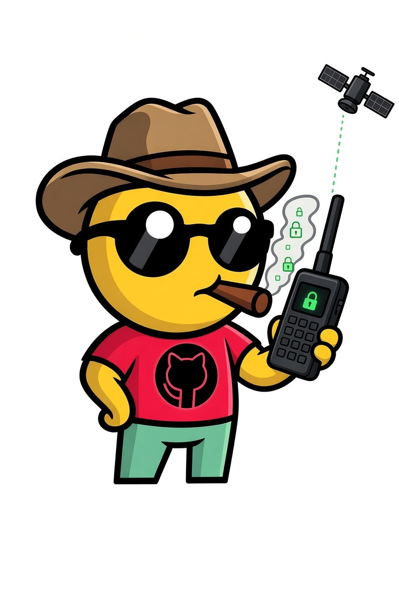

<p align="center">
  
</p>

<h1 align="center">OTRv4+</h1>

<p align="center"><strong>Private messaging and voice over I2P</strong></p>

<p align="center">
<code>v10.30.0 · Rust crypto core · chat (X448 + ML-KEM-1024, AES-256-GCM) · group chat (MLS: X448 + ML-KEM-1024, Ed448 + ML-DSA-87, AES-256-GCM) · hybrid PQC SMP (ML-KEM-1024 + ML-DSA-87 + ZKP) · voice (X448 + ML-KEM-1024, AES-256-GCM) · I2P SAM · AAudio · TUI</code>
</p>

OTRv4+ is an open-source client for end-to-end encrypted chat, encrypted
group chat, file transfer and voice calls. It is built around the I2P network
and needs no phone number. Tor and TLS also work for chat.

**Security status: extensively tested and hardened through developer-led and
AI-assisted analysis, but not independently audited.** See
[Security assessment and audit status](#security-assessment-and-audit-status)
for what that covers and what it does not.

## Android app (experimental)

**Download:** open the
[Releases page](https://github.com/muc111/OTRv4Plus/releases). Only the
newest Android build is kept there, so the one you see is the one to test.

1. Under **Assets**, tap `otrv4plus-<commit>-release.apk` (the `-debug.apk`
   is for diagnostics); optionally check its `release sha256`.
2. Open it and allow installs when Android asks. If Android refuses an
   update, uninstall the old build first (builds use a CI signing key).

**No separate I2P app is needed.** The app has an I2P router built in
(i2pd, SAM bridge on loopback only). With "I2P router: Automatic" it uses an
I2P app already running on the phone, and its own router otherwise. The first
start takes a few minutes (it joins I2P), later ones a minute or two. Android 8+.

**What has been tested on a phone:** sign-in, contacts, 1:1 chat, rooms,
OTRv4+ encryption, SMP identity verification, encrypted file transfer with a
Termux peer, two-way voice calls (app to app, and app to Termux),
end-to-end encrypted group chat (four accounts on two phones: two in the app,
two in Termux, all sending and receiving), and
account creation and login on an ordinary clearnet server (yax.im, over
TLS with the certificate verified).
**Not yet tested on a phone:** the newest additions listed in
[CHANGELOG.md](CHANGELOG.md). The step-by-step test list
is [ANDROID_CALL_AND_FILE_DEVICE_TEST.md](ANDROID_CALL_AND_FILE_DEVICE_TEST.md).

## Project status

| Area | Status |
|---|---|
| Chat over I2P, TLS | Working, tested live between two peers |
| Chat over Tor | Implemented, not yet tested against a real hidden service |
| Hybrid PQC handshake, ratchet and SMP | Working, not externally reviewed |
| File transfer | Working (XMPP) |
| Voice over I2P | Working between two phones, in Termux and in the app; still being tuned |
| Android app | Chat, OTRv4+, SMP, files and calls (to the app and to Termux) tested on phones |
| Encrypted group chat (MLS) | Working: four clients (two Android, two Termux) on two phones send and read each other's messages, on the hybrid post-quantum suite. Group voice calls are implemented but **not yet tested on a phone**. Ordinary rooms (and the Welcome room) are plain XMPP rooms that the server can read. See [Encrypted group chat](#encrypted-group-chat-mls) |
| Security review | Extensive developer-led and AI-assisted review, fuzzing, and known-answer and cross-implementation testing; **no paid independent audit yet**. See below and [CRYPTO_AUDIT_2026-09.md](CRYPTO_AUDIT_2026-09.md) |

## Security assessment and audit status

OTRv4+ has had extensive developer-led security review and hardening:
Rust unit and integration tests for the protocol and cryptography,
ML-KEM-1024 known-answer tests and a cross-implementation check against
Go's `crypto/mlkem`, differential tests for X448/Ed448, cargo-fuzz
harnesses on every Rust parser of untrusted input, attack and property
tests, Python and Kotlin suites, `cargo audit` in CI, threat-model and
Rust-authority reviews, AI-assisted review, and physical tests on
Android. Findings were fixed, each with a regression test.

It has **not** had a paid independent third-party audit or a formal
external cryptographic assessment, and that work is not equivalent to one.
Known limitations are recorded in [SECURITY_ISSUES.md](SECURITY_ISSUES.md);
some (A1, A2) need a future protocol version.

The evidence, layer by layer, is in
[SECURITY.md](SECURITY.md#security-assessment-and-audit-status).

## Cryptography

Hybrid classical + post-quantum cryptography: X448 with ML-KEM-1024 for key
agreement, Ed448 with ML-DSA-87 for authentication, keying established
AES-256-GCM for the message itself. OTR's Ed448 ring-signature deniability is
kept.

What actually encrypts a message, top to bottom:

```
        X448  +  ML-KEM-1024              key agreement (DAKE)
  Ed448 ring signature  +  ML-DSA-87      authentication: deniable, then hybrid PQ
                  |
                  v
      OTRv4+ double ratchet               a fresh ML-KEM-1024 exchange at
      SHAKE-256 key schedule              EVERY DH ratchet step, not just once
                  |
                  v
             AES-256-GCM
                  |
                  v
       encrypted OTR message
```

All of this runs in the Rust core (`otrv4_core`). Python handles networking
and Kotlin handles the Android screens; neither holds session keys. SMP
(identity verification) is also hybrid post-quantum and runs in Rust.

Details, design notes and caveats are in [TECHNICAL.md](TECHNICAL.md) and
[SPEC.md](SPEC.md).

## Encrypted group chat (MLS)

Secure groups use **MLS** (RFC 9420, through OpenMLS) with every primitive
from the same Rust core: hybrid KEM **X448 + ML-KEM-1024**, composite
signature **Ed448 + ML-DSA-87** (both must verify), AES-256-GCM, HKDF-SHA-384
(ciphersuite 0xF0A1). Standard MLS suites have no post-quantum protection;
these groups resist "record now, decrypt later". The XMPP room carries only
`?OTRv4MLS1:` ciphertext. Invitations and Welcomes travel inside 1:1 OTRv4+
sessions; keys move on at every membership change and on a timer;
a removed member reads nothing after the removal; messages typed while a
group resyncs wait instead of being lost. The server still sees the room,
its members and message timing. 0xF0A1 is a private code point and the
hybrid constructions are this project's own, not independently audited.
Details: [TECHNICAL.md](TECHNICAL.md#encrypted-group-chat-mls),
[MLS_SECURITY_HARDENING.md](MLS_SECURITY_HARDENING.md).

## Quick start

### Termux and Linux (terminal clients)

Termux on Android is the reference client. The same steps work on Linux.

**1. Install the tools.** Python 3.12 or newer is required.

```bash
# Termux
pkg install python rust openssl clang git
# Debian / Ubuntu: install python3, python3-pip, git, clang and Rust (rustup.rs)

pip install PySocks slixmpp aiodns
```

For voice calls in Termux, also run `pkg install libopus termux-api` and
`pip install opuslib`.

**2. Download and build the Rust core** (the first run on a phone takes
longer -- it also compiles the build tool once, see below; later builds are
much faster):

```bash
git clone -b claude/otrv4plus-android-spec-a3oq4d https://github.com/muc111/OTRv4Plus.git
cd OTRv4Plus/Rust
bash build.sh
cd ..
```

That branch matches the APK on the Releases page (`main` lags behind). To switch an
existing clone: `git fetch origin && git checkout claude/otrv4plus-android-spec-a3oq4d`.

`build.sh` sets up its own Python environment in `.venv`, runs the Rust tests and
lints, installs the core (with secure groups) and ends with `BUILD OK`. Keep Termux
open while it runs; details in [TECHNICAL.md](TECHNICAL.md#buildsh-in-detail).

**3. Update later.** Pull, then rebuild the core (both Python and Rust change):

```bash
cd ~/OTRv4Plus
git pull
cd Rust && bash build.sh && cd ..
git log -1 --format='%h %ad'     # check you are on the latest commit
```

Keys and settings live in `~/.otrv4plus`, outside the repository; updates leave them.

**4. Networks.** For I2P, run an I2P router with the SAM bridge on port 7656
(for example the I2P app, with "Use SAM bridge" enabled). For Tor, run Orbot
with SOCKS on port 9050. Plain TLS needs nothing extra.

**5. Run it.**

XMPP over I2P (chat, files and voice):

```bash
PYTHONMALLOC=malloc .venv/bin/python otrv4plus_xmpp.py \
  --jid you@yourserver.i2p --peer friend@yourserver.i2p
```

Add `--server <address>.b32.i2p` if your server name does not resolve, and
`--voice-debug` for call diagnostics every 5 seconds.

IRC (defaults to `irc.postman.i2p` over I2P; `-s irc.libera.chat` for TLS):

```bash
PYTHONMALLOC=malloc .venv/bin/python otrv4+.py
```

**6. First commands** (XMPP; IRC uses the same `/otr` and `/smp`):

```
/otr              start an encrypted session
/smp              verify identity with a passphrase agreed in person
/call             encrypted voice call (after SMP); /answer, /hangup
/sendfile <path>  encrypted file transfer (after SMP)
/status           session, trust and verification state
/help             every command
```

Encrypted group chat (XMPP): `/group create mls3` (then its passphrase),
`/group invite mls3 bob`, `y` to join, then just type; `/group verify mls3`
checks every member with the passphrase, then `/group call mls3`. In the
app: Rooms, then "Create end-to-end encrypted group"; Verify, then Call.

Building on musl (Alpine), every option and all commands are in
[TECHNICAL.md](TECHNICAL.md).

## Documentation

- [TECHNICAL.md](TECHNICAL.md): the full technical reference
- [SPEC.md](SPEC.md): wire-level protocol specification
- [SECURITY.md](SECURITY.md): threat model and known issues
- [CHANGELOG.md](CHANGELOG.md): what changed in each version
- [MLS_SECURITY_HARDENING.md](MLS_SECURITY_HARDENING.md): encrypted group chat (MLS) design and threat model
- [OTRV4PLUS_CAPABILITY.md](OTRV4PLUS_CAPABILITY.md): how the app decides who can receive OTRv4+
- [PROSODY_USER_DISCOVERY.md](PROSODY_USER_DISCOVERY.md): the People list and the Welcome room
- [CONTRIBUTING.md](CONTRIBUTING.md): how to contribute

## License

OTRv4+ is dual-licensed:

```
AGPL-3.0-only OR LicenseRef-OTRv4Plus-Commercial
```

- [AGPL-3.0](LICENSE) is the default. You may use, change and share it; if you
  distribute it or run a modified version as a network service, you must
  offer your source.
- A [commercial licence](LICENSE-COMMERCIAL.md) is available for closed-source
  use.

Releases up to and including v10.16.2 were published under GPL-3.0, and
anyone who received them keeps those GPL-3.0 rights permanently. The move to
AGPL-3.0 applies from v10.17.0 onward. It does not, and could not, take back
rights already granted.

Documentation is licensed under [CC BY-SA 4.0](LICENSES/CC-BY-SA-4.0.txt).
Third-party attributions are in [NOTICE](NOTICE), which must be included with
any binary you distribute. [LICENSING.md](LICENSING.md) has the full picture.
